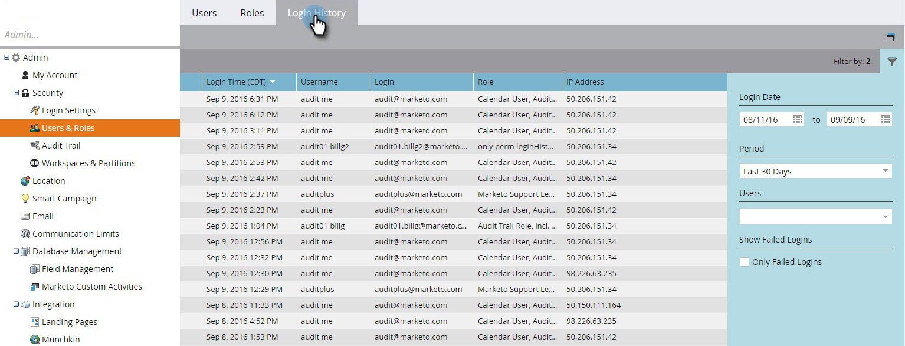

# Cronologia di accesso utente {#user-login-history}

La cronologia degli accessi utente consente di mantenere la responsabilità e la sicurezza mostrando esattamente chi ha effettuato l’accesso all’abbonamento, inclusi i tentativi di accesso non riusciti.

>[!PREREQUISITES]
>
>Per visualizzare la cronologia degli accessi utente, è necessario disporre di un ruolo con l&#39;autorizzazione Cronologia accessi abilitata.

La cronologia degli accessi utente identifica gli utenti che accedono tramite:

* Data e ora di accesso
* Nome e indirizzo e-mail dell’utente
* Ruolo
* Area di lavoro
* Indirizzo IP

Per visualizzare la cronologia degli accessi utente:

1. Vai a **[!UICONTROL Amministratore]** area.

   

1. In Protezione, fai clic su **[!UICONTROL Utenti e ruoli]**.

   

1. Fai clic su **[!UICONTROL Cronologia accesso]** scheda. L’elenco mostra gli accessi più recenti.

   

1. Usa il Filtro per restringere la ricerca.

   

1. Seleziona un intervallo di date utilizzando i selettori di date.

   

1. Oppure, scegli dall’elenco a discesa.

   

1. Seleziona gli utenti dal **[!UICONTROL Utenti]** a discesa.

   

1. Controlla la **[!UICONTROL Solo accessi non riusciti]** per visualizzare solo gli accessi non riusciti nella ricerca.

   

1. Clic **[!UICONTROL Applica]**.

   

   >[!NOTE]
   >
   >L’interfaccia utente visualizza fino a 30 giorni di dati. Se hai bisogno di più, puoi scaricare i dati degli ultimi sei mesi in un file csv.

   >[!MORELIKETHIS]
   >
   >[Panoramica di Audit Trail](/help/marketo/product-docs/administration/audit-trail/audit-trail-overview.md)
