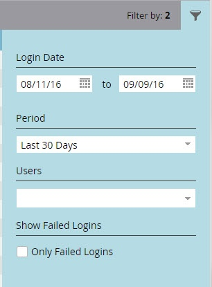

# Cronologia accessi utente {#user-login-history}

La cronologia degli accessi utente consente di mantenere la responsabilità e la sicurezza mostrando esattamente chi ha effettuato l’accesso all’abbonamento, compresi i tentativi di accesso non riusciti.

>[!PREREQUISITES]
>
>Per visualizzare la cronologia degli accessi utente, è necessario disporre di un ruolo con l’autorizzazione per l’abilitazione della cronologia degli accessi.

La cronologia degli accessi utente identifica le persone che effettuano l’accesso tramite:

* Ora e data di accesso
* Nome utente e indirizzo e-mail
* Ruolo
* Area di lavoro
* Indirizzo IP

Per visualizzare la cronologia degli accessi utente:

1. Vai a **Amministratore** area.

   

1. In Sicurezza, fai clic su **Utenti e ruoli**.

   

1. Fai clic sul pulsante **Cronologia accessi** scheda . L’elenco mostra gli accessi più recenti.

   

1. Usa il filtro per restringere la ricerca.

   

1. Seleziona un intervallo di date utilizzando i selettori di date.

   

1. Oppure, scegli dal menu a discesa.

   

1. Seleziona gli utenti dal **Utenti** a discesa.

   

1. Controlla la **Solo accessi non riusciti** per visualizzare solo gli accessi non riusciti nella ricerca.

   

1. Fai clic su **Applica**.

   

   >[!NOTE]
   >
   >L’interfaccia utente visualizza fino a 30 giorni di dati. Se ne hai bisogno di più, puoi scaricare i dati più recenti in un file csv.

   >[!NOTE]
   >
   >[Panoramica della traccia di audit](/help/marketo/product-docs/administration/audit-trail/audit-trail-overview.md)
