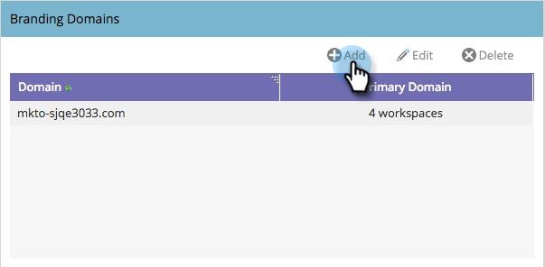

# Aggiungere un ulteriore dominio di branding con le aree di lavoro {#add-an-additional-branding-domain-with-workspaces}

Se disponi di aree di lavoro, puoi aggiungere altri domini di branding.

>[!PREREQUISITES]
>
>Devi [modificare prima il dominio di branding predefinito](/help/marketo/product-docs/administration/email-setup/add-multiple-branding-domains/edit-your-default-branding-domain.md).
>
>Prima di aggiungere altri domini di branding, devi [sostituire il collegamento di tracciamento generico](/help/marketo/product-docs/administration/email-setup/add-multiple-branding-domains/edit-your-default-branding-domain-with-workspaces.md) con un dominio di branding.

1. Passa alla schermata **[!UICONTROL Admin]**.

   

1. Fai clic su **[!UICONTROL Email]**.

   

1. Fare clic su **[!UICONTROL Add]** per aggiungere un dominio di branding aggiuntivo.

   

1. Immetti un nuovo dominio di branding. Fai clic su **[!UICONTROL Next]**.

   

   >[!NOTE]
   >
   >Puoi scegliere di impostare questo dominio come dominio principale per una o più aree di lavoro; tutte le e-mail non inviate esistenti verranno impostate su &quot;Predefinito&quot; e tutte le e-mail appena create verranno impostate come dominio principale per impostazione predefinita. Puoi ignorarlo per e-mail.

1. Selezionare il nuovo dominio di branding e fare clic su **[!UICONTROL Save]**.

   
