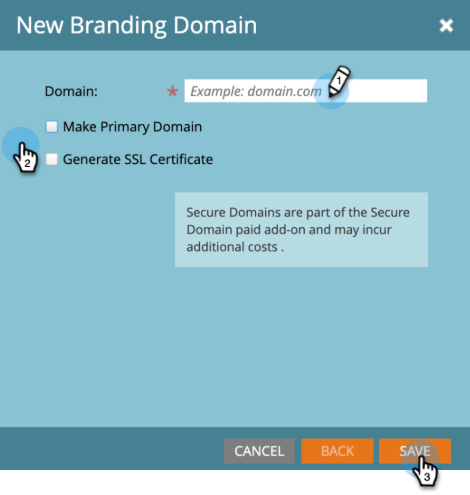
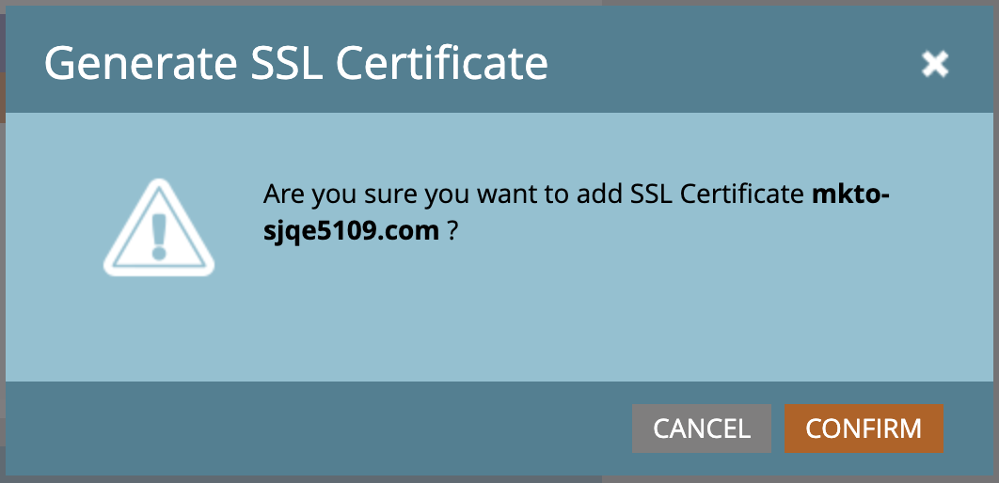

# Aggiungere un ulteriore dominio di branding {#add-an-additional-branding-domain}

Aggiungi un dominio di branding aggiuntivo quando esegui più marchi da una singola istanza di Marketo e vuoi che ciascuno di essi abbia i propri collegamenti di tracciamento del brand.

>[!PREREQUISITES]
>
>È necessario [sostituire il collegamento di tracciamento generico](/help/marketo/product-docs/administration/email-setup/add-multiple-branding-domains/edit-your-default-branding-domain.md){target="_blank"} con un dominio con marchio prima di aggiungere altri domini con marchio.

1. Passa alla schermata **[!UICONTROL Admin]**.

   

1. Fai clic su **[!UICONTROL Email]**.

   

1. Fare clic su **[!UICONTROL Add]** per aggiungere un dominio di branding aggiuntivo.

   {width="600"}

1. Immettere il nome del nuovo dominio di branding, selezionare _Rendi dominio primario_ e/o _Genera certificato SSL_ (entrambi facoltativi) e fare clic su **[!UICONTROL Save]**.

   

>[!NOTE]
>
>* _Rendi dominio primario_: imposta questo dominio primario come dominio principale e tutti i messaggi e-mail non inviati esistenti su &quot;Predefinito&quot;; tutti i messaggi e-mail appena creati verranno impostati come dominio primario come predefinito. Puoi [sovrascriverlo per ogni e-mail](/help/marketo/product-docs/administration/email-setup/add-multiple-branding-domains/overwrite-primary-domain-for-emails.md){target="_blank"}.
>
>* _Genera certificato SSL_: è possibile creare un SSL (Secure Sockets Layer) con la creazione del dominio. Il primo dominio di tracciamento avvierà la configurazione una tantum dell’infrastruttura, che potrebbe richiedere alcune ore. Riceverai una notifica al termine dell’operazione e potrai quindi impostare il primo dominio. Per aggiungere SSL ai domini esistenti, contattare il [Supporto Marketo](https://nation.marketo.com/t5/support/ct-p/Support){target="_blank"}.

## Modifica SSL per i domini esistenti

Per abilitare SSL per i domini esistenti, segui la procedura riportata di seguito.

1. Dall&#39;area _[!UICONTROL Admin]_, selezionare **[!UICONTROL Email]**.

1. Nella scheda _[!UICONTROL Domain]_selezionare la riga del dominio e fare clic su **[!UICONTROL Add SSL]**.

   {width="600"}

1. Nella finestra di dialogo, fai clic su **[!UICONTROL Confirm]**.

   {width="400"}

## Messaggi di errore {#error-messages}

<table><thead>
  <tr>
    <th>Errore</th>
    <th>Dettagli</th>
  </tr></thead>
<tbody>
<tr>
    <td><i>Il dominio esiste già.</i></td>
    <td>Esiste già un dominio con lo stesso nome.</td>
  </tr>
  <tr>
    <td><i>Il dominio non è mappato al dominio predefinito.</i></td>
    <td>Il dominio personalizzato non è mappato correttamente al dominio predefinito. Verificare le impostazioni di mappatura del dominio e assicurarsi che la configurazione DNS punti al dominio predefinito corretto.</td>
  </tr>
  <tr>
    <td><i>Impossibile rilasciare i certificati SSL a causa di record CAA non supportati. Richiedi al tuo reparto IT di aggiornare i tuoi record CAA.</i></td>
    <td>Record CAA non aggiornati. Per coloro che utilizzano certificati SSL gestiti da Marketo Engage, i record CAA devono essere aggiornati ai certificati consigliati dal nostro fornitore. Contatta il reparto IT per aggiornare i record CAA. Vedi <a href="https://nation.marketo.com/t5/product-blogs/changes-to-marketo-engage-secured-domains-platform/ba-p/329305#M2246">questa pagina</a> per ulteriori dettagli.</td>
  </tr>
  <tr>
    <td><i>Il certificato SSL è già stato rilasciato.</i></td>
    <td>Esiste già un certificato SSL per questo dominio personalizzato. Non sono necessarie ulteriori azioni a meno che il certificato non sia scaduto o debba essere nuovamente rilasciato.</td>
  </tr>
  <tr>
    <td><i>Dominio predefinito non trovato. Contatta il supporto per assistenza.</i></td>
    <td>Si è verificato un problema durante il tentativo di individuare il dominio predefinito. Rivolgiti al Supporto tecnico per consentire loro di svolgere indagini approfondite.</td>
  </tr>
  <tr>
    <td><i>Errore imprevisto durante la creazione di un dominio. Contatta il supporto per assistenza.</i></td>
    <td>Si è verificato un errore imprevisto. Raccogliere i registri e i dettagli degli errori e inoltrare il problema al <a href="https://nation.marketo.com/t5/support/ct-p/Support" target="_blank">Supporto Marketo</a>.</td>
  </tr>
</tbody></table>

## Aspetti da considerare {#things-to-note}

* **Mappatura DNS per il dominio in Marketo Engage**: prima di aggiungere domini nell&#39;interfaccia utente, è necessario [mappare i CNAME in un dominio fornito da Marketo](https://experienceleague.adobe.com/en/docs/marketo/using/getting-started/initial-setup/setup-steps#customize-your-landing-page-urls-with-a-cname){target="_blank"}.

* **SSL personalizzati**: se hai bisogno di un SSL personalizzato, invia un [ticket di supporto](https://nation.marketo.com/t5/support/ct-p/Support){target="_blank"}. Non utilizzare la casella di controllo self-service per la creazione SSL.

* **SSL preesistenti**: durante l&#39;aggiunta di un dominio, il sistema verifica la presenza di SSL preesistenti, che potrebbero essere stati creati manualmente in precedenza. Se si verifica questa convalida, crea il dominio senza selezionare la creazione SSL, che verrà connessa automaticamente. [Contatta il supporto](https://nation.marketo.com/t5/support/ct-p/Support){target="_blank"} per ulteriori dettagli/opzioni.

* **Eliminazione di domini**: l&#39;eliminazione automatica di un dominio **non** comporta l&#39;eliminazione del certificato SSL. Questo guardrail evita errori degli utenti che determinano la mancanza di certificati SSL in un sito Web. Se desideri rimuovere i certificati SSL, [contatta il supporto](https://nation.marketo.com/t5/support/ct-p/Support){target="_blank"}.

>[!MORELIKETHIS]
>
>[Modifica il dominio di branding predefinito](/help/marketo/product-docs/administration/email-setup/add-multiple-branding-domains/edit-your-default-branding-domain.md){target="_blank"}
