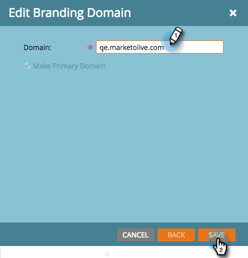

# Modifica il dominio di branding predefinito {#edit-your-default-branding-domain}

La modifica del dominio di branding predefinito è il primo passaggio nell’utilizzo dei domini di branding.

>[!PREREQUISITES]
>
>Assicurati di aver [configurare un CNAME nel DNS](/help/marketo/getting-started/setup/configure-protocols-for-marketo.md) prima di aggiungere i domini di branding in Marketo.

1. Vai a **[!UICONTROL Amministratore]** area.

   

1. Clic **[!UICONTROL E-mail]**.

   

1. In [!UICONTROL Domini di branding] nella tabella, seleziona il dominio generico e fai clic su Modifica per modificarlo in dominio con marchio della tua azienda.

   

   >[!NOTE]
   >
   >Non puoi aggiungere un dominio aggiuntivo finché non hai prima modificato il dominio generico.

1. Immetti il nome del dominio predefinito e fai clic su **[!UICONTROL Salva]**.

   

Ora puoi [aggiungi altri domini di branding](/help/marketo/product-docs/administration/email-setup/add-multiple-branding-domains/add-an-additional-branding-domain.md) ti serve.
