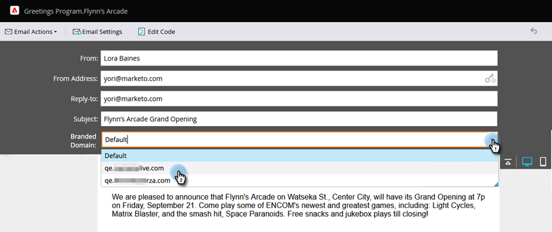

# Sovrascrivere il dominio primario per e-mail {#overwrite-primary-domain-for-emails}

Puoi sovrascrivere il dominio primario del marchio per e-mail. Questo cambierà il modo in cui i collegamenti vengono contrassegnati al momento dell’invio dell’e-mail.

1. Passa a **[!UICONTROL Marketing Activities]**.

   

1. Selezionare un&#39;e-mail e fare clic su **[!UICONTROL Edit Draft]**.

   

1. Seleziona il dominio di branding da utilizzare.

   

   >[!NOTE]
   >
   >Non tutti gli utenti dispongono delle autorizzazioni necessarie per impostare il dominio con marchio per e-mail. Contatta l&#39;amministratore se non trovi il menu a discesa [!UICONTROL Branded Domains].
