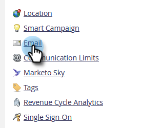

# Modifica dei limiti di recupero degli oggetti personalizzati in [!DNL Velocity Scripting] {#change-custom-object-retrieval-limits-in-velocity-scripting}

Se utilizzi [!DNL Velocity Script] per visualizzare i dati degli oggetti personalizzati nelle e-mail, questa funzione potrebbe essere applicabile al tuo caso d&#39;uso. Per impostazione predefinita, è consentito l’accesso a 10 oggetti personalizzati principali dallo script Velocity. Per ulteriori informazioni, consulta la procedura riportata di seguito.

## Cos&#39;è [!DNL Velocity] {#what-is-velocity}

[[!DNL Apache Velocity]](https://velocity.apache.org/) è un linguaggio basato su [!DNL Java] progettato per la creazione di modelli e lo scripting del contenuto di HTML. Marketo consente di utilizzarlo nel contesto delle e-mail tramite [token di script](/help/marketo/product-docs/email-marketing/general/using-tokens/create-an-email-script-token.md). Questo consente, tra l’altro, di accedere ai dati memorizzati negli oggetti personalizzati.

È possibile fare riferimento a oggetti personalizzati padre e figlio che sono direttamente connessi al lead o al contatto, ma non a oggetti personalizzati di terzo livello. Per ogni oggetto personalizzato, i 10 record aggiornati più di recente per persona/contatto sono disponibili in fase di esecuzione e vengono ordinati dall’ultimo aggiornamento (in corrispondenza di 0) a quello più recente (in corrispondenza di 9).

## Come modificare il limite {#how-to-change-the-limit}

1. Passare alla sezione **[!UICONTROL Admin]**.

   

1. Fai clic su **[!UICONTROL Email]**.

   

1. Nella tabella [!UICONTROL Custom Object Retrieval Limits], immettere un nuovo [!UICONTROL Parent Retrieval Limit] e fare clic su **[!UICONTROL Save Changes]**.

   

>[!NOTE]
>
>Il valore [!UICONTROL Parent Retrieval Limit] deve essere compreso tra 10 e 100. [!UICONTROL Child Retrieval Limit] viene impostato automaticamente. A tale scopo, dividere 1000 per [!UICONTROL Parent Retrieval Limit]. Ad esempio, se si imposta il limite Padre su 50, il limite Figlio diventa 20 (1000 ÷ 50 = 20).

È ora possibile accedere a più oggetti personalizzati da [!DNL Velocity script].
