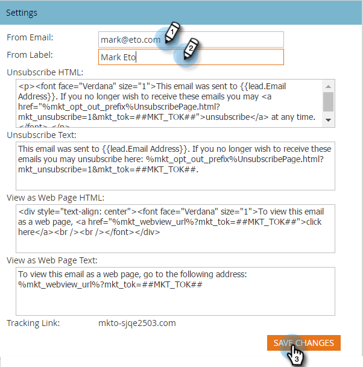

# Modifica l&#39;etichetta Predefinita Da e-mail e Da {#change-the-default-from-email-and-from-label}

Ogni utente amministratore può modificare i valori predefiniti per **[!UICONTROL Da e-mail]** e **[!UICONTROL Etichetta Da]** in modo che, quando vengono create nuove e-mail, vengano utilizzate queste impostazioni predefinite.

>[!NOTE]
>
>**Autorizzazioni amministratore richieste**

1. Vai a **[!UICONTROL Amministratore]** sezione.

   

1. Clic **[!UICONTROL E-mail]**.

   

1. Immettere i valori predefiniti desiderati per **[!UICONTROL Da e-mail]** e **[!UICONTROL Etichetta Da]** quindi fai clic su **[!UICONTROL Salva modifiche]**.

   

>[!NOTE]
>
>La modifica è applicabile solo a te e non ad altri utenti di Marketo.

Ottimo lavoro! Ogni volta che crei una nuova e-mail verranno utilizzati i valori predefiniti impostati.
