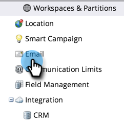

# Modificare il messaggio di annullamento dell’abbonamento {#edit-the-unsubscribe-message}

>[!NOTE]
>
>**Autorizzazioni amministratore richieste**

Quando invii e-mail di marketing (non-[operativo](/help/marketo/product-docs/email-marketing/general/functions-in-the-editor/make-an-email-operational.md)), il testo dell’annullamento dell’abbonamento e i collegamenti sono aggiunti in basso. È possibile modificare le impostazioni predefinite. Ecco come.

## Dove effettuare la modifica {#where-to-make-the-edit}

1. Vai a **Amministratore** sezione .

   

1. Fai clic su **E-mail**.

   

   >[!CAUTION]
   >
   >Le seguenti variabili sono fondamentali. Non cancellarle!
   >
   >* `%mkt_opt_out_prefix%`
   >* `mkt_unsubscribe=1&mkt_tok=##MKT_TOK##`

1. Modifica le **Annulla sottoscrizione HTML** e **Testo non registrato** versioni a tuo piacimento e fai clic su **Salva modifiche**.

   

   Ecco qua. _Assicurati di provare!_ Non vuoi che le tue e-mail di marketing dispongano di collegamenti di annullamento dell’abbonamento interrotti.

>[!TIP]
>
>Puoi personalizzare la posizione del HTML di annullamento dell’abbonamento nell’e-mail utilizzando [gettoni](/help/marketo/product-docs/email-marketing/general/using-tokens/add-a-system-token-as-a-link-in-an-email.md).

## Testo per annullamento sottoscrizione predefinito {#default-unsubscribe-text}

Per ripristinare l’annullamento dell’abbonamento al sistema predefinito, copia/incolla quanto segue:

Annulla sottoscrizione HTML:
`<pre data-theme="Confluence">
If you no longer wish to receive these emails, click on the following link: <a href="%mkt_opt_out_prefix%UnsubscribePage.html?mkt_unsubscribe=1&mkt_tok=##MKT_TOK##">Unsubscribe</a> 
</pre>` Testo per annullamento sottoscrizione:
`<pre data-theme="Confluence">%mkt_opt_out_prefix%UnsubscribePage.html?mkt_unsubscribe=1&mkt_tok=##MKT_TOK##</pre>`

>[!MORELIKETHIS]
>
>[Modificare il messaggio &quot;Visualizza come pagina web&quot;](/help/marketo/product-docs/administration/email-setup/edit-the-view-as-web-page-message.md)
