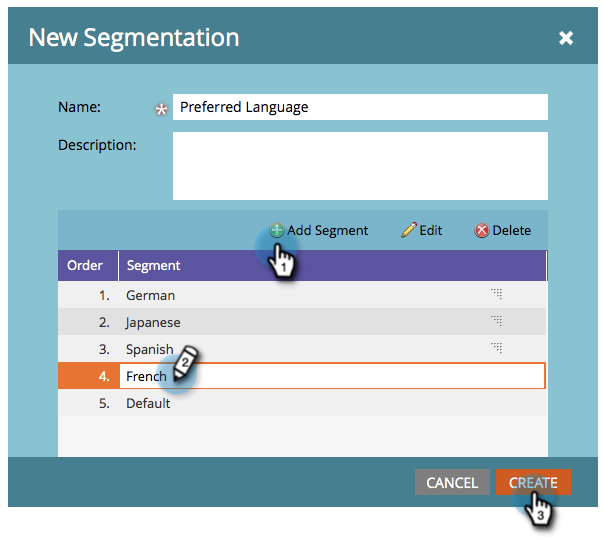
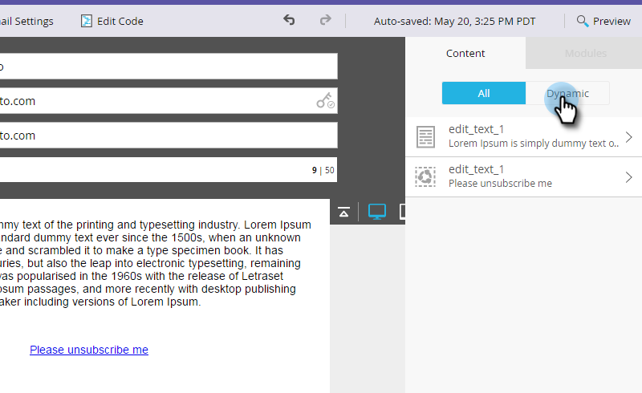

# Rendi il messaggio di annullamento dell’abbonamento dinamico per le lingue {#make-your-unsubscribe-message-dynamic-for-languages}

Il messaggio e il collegamento di annullamento dell’abbonamento predefiniti sono in inglese. È possibile utilizzare il contenuto dinamico per visualizzarlo in lingue diverse.

>[!NOTE]
>
>Abbiamo impostato questo piccolo tutorial qui sotto per voi. Rappresenta una best practice, ma può essere eseguita in altri modi.

## Prepara i dati {#prepare-your-data}

1. [Crea un ](/help/marketo/product-docs/administration/field-management/create-a-custom-field-in-marketo.md) campo personalizzato denominato &quot;Lingua preferita&quot;. (Configuralo nel tuo CRM se desideri che questo campo si sincronizzi).

   >[!TIP]
   >
   >In futuro, utilizza questo campo quando [crei un modulo](/help/marketo/product-docs/demand-generation/forms/creating-a-form/create-a-form.md) per acquisire le preferenze relative alla lingua.

## Crea segmentazione {#create-segmentation}

1. Vai al **Database**.

   

1. Nel menu a discesa **Nuovo** , fai clic su **Nuova segmentazione**.

   

1. Denomina la segmentazione **Lingua preferita**. Fai clic su **Aggiungi segmento**. Digita una lingua.

   

   >[!NOTE]
   >
   >Il segmento predefinito è Inglese.

1. Continua ad aggiungere segmenti finché non vengono rappresentate tutte le lingue. Fare clic su **Crea**.

   

1. Seleziona un segmento.

   

1. Vai alla scheda **Smart List** . Inserisci **Lingua preferita** nel campo di ricerca. Trascina e rilascia il filtro sull’area di lavoro.

   

1. Impostare la lingua corrispondente appropriata.

   

1. Ripeti per tutte le tue diverse lingue. Quindi, seleziona il menu a discesa **Azioni di segmentazione** e fai clic su **Approva**.

   

## Creare un frammento {#create-a-snippet}

1. Vai a **Design Studio**.

   

1. Nel menu a discesa **Nuovo**, fai clic su **Nuovo frammento**.

   

1. Denomina lo snippet **Annulla sottoscrizione messaggio**. Fare clic su **Crea**.

   

1. Digita il messaggio di annullamento sottoscrizione predefinito, evidenzialo e fai clic sull’icona del collegamento ipertestuale.

   

1. Copia e incolla questo token: `{{system.unsubscribeLink}}` nel campo **Collega URL** . Fare clic su **Inserisci**.

   

1. Seleziona **Segmento per** nella sezione Segmentazione .

   

1. Dal menu a discesa Segmentazione, digita **Preferred** e seleziona **Preferred Language**. Fare clic su **Salva**.

   

1. Seleziona un segmento dalla struttura. Digita il messaggio di annullamento dell’abbonamento in tale lingua.

   

1. Copia e incolla lo stesso token: `{{system.unsubscribeLink}}` nel campo **Collega URL** . Fare clic su **Inserisci**.

   

1. Ripeti per tutti i segmenti. Quindi, torna a Design Studio, fai clic sul menu a discesa **Azioni frammento** e fai clic su **Approva**.

   

   Fantastico. Quasi lì.

## Usa snippet in un&#39;e-mail {#use-snippet-in-an-email}

1. All’interno dell’editor e-mail, fai clic sull’elemento modificabile . Quindi fai clic sull&#39;icona a forma di ingranaggio e seleziona **Sostituisci con snippet**. Se selezioni un elemento snippet modificabile, fai clic sull&#39;icona a forma di ingranaggio e seleziona **Modifica**.

   

1. Trova e seleziona il tuo frammento dal menu a discesa e fai clic su **Salva**.

   

1. Per eseguire il test, fai clic su **Indietro**...

   

1. ...quindi la scheda **Dinamico**.

   

1. Fai clic sulle diverse lingue per visualizzare la modifica dello snippet.

   

   >[!TIP]
   >
   >Naturalmente, puoi modificare il resto dell’e-mail anche per la lingua dinamica. Mentre ti trovi, procedi con la stessa tecnica nella pagina di annullamento dell’abbonamento.

## Personalizzazione della pagina di annullamento dell’abbonamento con contenuto dinamico {#customizing-your-unsubscribe-page-with-dynamic-content}

Se desideri che le persone accedano a una pagina di annullamento dell’abbonamento nella lingua preferita, puoi utilizzare il contenuto dinamico nella pagina di destinazione e nella pagina di conferma.

1. Passare a Design Studio.

   

1. Digita _Annulla sottoscrizione_ nel campo di ricerca. Troverai le tue pagine Annulla sottoscrizione.

   

1. Fare clic su **Modifica bozza**.

   

1. Seleziona **Segmento per**.

   

1. Trova il segmento Lingua preferita . Fare clic su **Salva**.

   

   Modifica il contenuto per ogni pagina di destinazione, approva e sei pronto a partire!

   >[!NOTE]
   >
   >Ulteriori informazioni su [contenuto dinamico](/help/marketo/product-docs/personalization/segmentation-and-snippets/segmentation/understanding-dynamic-content.md) e su tutte le operazioni interessanti che puoi eseguire.
