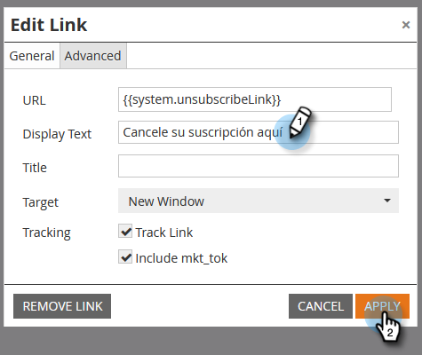

# Rendi dinamico il messaggio di annullamento dell’iscrizione per le lingue {#make-your-unsubscribe-message-dynamic-for-languages}

Il messaggio e il collegamento di annullamento dell’iscrizione predefiniti sono in inglese. Puoi utilizzare il contenuto dinamico per visualizzarlo in lingue diverse.

>[!NOTE]
>
>Questo articolo rappresenta una best practice, ma può essere eseguito in altri modi.

## Preparare i dati {#prepare-your-data}

1. [Creare un campo personalizzato](/help/marketo/product-docs/administration/field-management/create-a-custom-field-in-marketo.md) denominata &quot;Preferred Language&quot;. (configuralo nel tuo CRM se vuoi che questo campo venga sincronizzato).

   >[!TIP]
   >
   >In futuro, utilizza questo campo quando [creare un modulo](/help/marketo/product-docs/demand-generation/forms/creating-a-form/create-a-form.md) per acquisire la preferenza della lingua.

## Crea segmentazione {#create-segmentation}

1. Vai a **[!UICONTROL Database]**.

   

1. In **[!UICONTROL Nuovo]** a discesa, fai clic su **[!UICONTROL Nuova segmentazione]**.

   

1. Denomina la segmentazione **[!UICONTROL Lingua preferita]**. Clic **[!UICONTROL Aggiungi segmento]**. Digita in una lingua.

   

   >[!NOTE]
   >
   >Il segmento predefinito sarà Inglese.

1. Continua ad aggiungere segmenti fino a quando non saranno rappresentate tutte le lingue. Fai clic su **[!UICONTROL Crea]**.

   

1. Seleziona un segmento.

   

1. Vai a **[!UICONTROL Elenco avanzato]** scheda. Invio **[!UICONTROL Lingua preferita]** nel campo di ricerca. Trascina e rilascia il filtro nell’area di lavoro.

   

1. Imposta la lingua corrispondente appropriata.

   

1. Ripeti per tutte le diverse lingue. Quindi, seleziona la **[!UICONTROL Azioni di segmentazione]** e fai clic su **[!UICONTROL Approva]**.

   

## Creare uno snippet {#create-a-snippet}

1. Vai a **[!UICONTROL Design Studio]**.

   

1. In **[!UICONTROL Nuovo]** a discesa, fai clic su **[!UICONTROL Nuovo snippet]**.

   

1. Denomina lo snippet **Messaggio di annullamento iscrizione**. Fai clic su **[!UICONTROL Crea]**.

   

1. Digita il messaggio predefinito di annullamento dell’iscrizione, evidenzialo e fai clic sull’icona del collegamento ipertestuale.

   

1. Copia e incolla questo token: `{{system.unsubscribeLink}}` in **[!UICONTROL URL]** campo. Clic **[!UICONTROL Inserisci]**.

   

1. Seleziona **[!UICONTROL Segmento per]** nel **[!UICONTROL Segmentazione]** sezione.

   

1. Dalla sezione **[!UICONTROL Segmentazione]** a discesa, digitare **[!UICONTROL Preferito]** e seleziona **[!UICONTROL Lingua preferita]**. Clic **[!UICONTROL Salva]**.

   

1. Seleziona un segmento dalla struttura. Fai clic sul collegamento per annullare l’iscrizione, quindi sull’icona del collegamento.

   

1. Assicurati che `{{system.unsubscribeLink}}` è ancora in **[!UICONTROL URL]** campo. Modifica il **[!UICONTROL Visualizza testo]** in base alla lingua selezionata. Clic **[!UICONTROL Applica]**.

   

1. Ripeti per tutti i segmenti. Quindi, torna al **[!UICONTROL Design Studio]**, fare clic su **[!UICONTROL Azioni snippet]** e fai clic su **[!UICONTROL Approva]**.

   

Fantastico. Ci siamo quasi!

## Utilizzare lo snippet in un messaggio e-mail {#use-snippet-in-an-email}

1. Nell’editor e-mail, fai clic sull’elemento modificabile. Quindi fai clic sull’icona a forma di ingranaggio e seleziona. **[!UICONTROL Sostituisci con snippet]**. Se selezioni un elemento snippet modificabile, fai clic sull’icona a forma di ingranaggio e seleziona **[!UICONTROL Modifica]**.

   

1. Trova e seleziona il frammento di codice dall’elenco a discesa e fai clic su **[!UICONTROL Salva]**.

   

1. Per verificarlo, fai clic su **[!UICONTROL Indietro]**...

   

1. ...quindi il **[!UICONTROL Dinamico]** scheda.

   

1. Fare clic sulle diverse lingue per visualizzare la modifica dello snippet.

   

   >[!TIP]
   >
   >Naturalmente, puoi modificare anche il resto dell’e-mail per il linguaggio dinamico. Mentre lo fai, utilizza la stessa tecnica nella pagina per annullare l’abbonamento.

## Personalizzazione della pagina per annullare l’iscrizione con contenuti dinamici {#customizing-your-unsubscribe-page-with-dynamic-content}

Se desideri che le persone visitino una pagina per l’annullamento dell’abbonamento nella lingua preferita, puoi utilizzare il contenuto dinamico nelle pagine di destinazione e di conferma.

1. Accedi a **[!UICONTROL Design Studio]**.

   

1. Digitare in _Annulla iscrizione_ nel campo di ricerca e seleziona la pagina di annullamento dell’abbonamento desiderata.

   

1. Clic **[!UICONTROL Modifica bozza]**.

   

1. Seleziona **[!UICONTROL Segmento per]**.

   

1. Trova il **[!UICONTROL Lingua preferita]** segmento. Clic **[!UICONTROL Salva]**.

   

   Modifica il contenuto per ogni pagina di destinazione, approva e non è necessario ripetere questa operazione.

   >[!NOTE]
   >
   >Ulteriori informazioni su [contenuto dinamico](/help/marketo/product-docs/personalization/segmentation-and-snippets/segmentation/understanding-dynamic-content.md) e tutte le cose interessanti che puoi fare.
