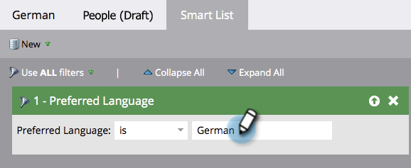

# Rendere dinamico il messaggio di annullamento dell’iscrizione per le lingue {#make-your-unsubscribe-message-dynamic-for-languages}

Il messaggio e il collegamento di annullamento dell’iscrizione predefiniti sono in inglese. Puoi utilizzare il contenuto dinamico per visualizzarlo in lingue diverse.

>[!NOTE]
>
>Questo articolo rappresenta una best practice, ma può essere eseguito in altri modi.

## Preparare i dati {#prepare-your-data}

1. [Crea un campo personalizzato](/help/marketo/product-docs/administration/field-management/create-a-custom-field-in-marketo.md) denominato &quot;Lingua preferita&quot;. (configuralo nel tuo CRM se vuoi che questo campo venga sincronizzato).

   >[!TIP]
   >
   >In futuro, utilizzare questo campo quando si [crea un modulo](/help/marketo/product-docs/demand-generation/forms/creating-a-form/create-a-form.md) per acquisire le preferenze della lingua.

## Crea segmentazione {#create-segmentation}

1. Passare a **[!UICONTROL Database]**.

   

1. Nel menu a discesa **[!UICONTROL New]**, fare clic su **[!UICONTROL New Segmentation]**.

   

1. Denomina la segmentazione **[!UICONTROL Preferred Language]**. Fare clic su **[!UICONTROL Add Segment]**. Digita in una lingua.

   

   >[!NOTE]
   >
   >Il segmento predefinito sarà Inglese.

1. Continua ad aggiungere segmenti fino a quando non saranno rappresentate tutte le lingue. Fai clic su **[!UICONTROL Create]**.

   

1. Seleziona un segmento.

   

1. Passa alla scheda **[!UICONTROL Smart List]**. Immetti **[!UICONTROL Preferred Language]** nel campo di ricerca. Trascina e rilascia il filtro nell’area di lavoro.

   

1. Imposta la lingua corrispondente appropriata.

   

1. Ripeti per tutte le diverse lingue. Selezionare quindi il menu a discesa **[!UICONTROL Segmentation Actions]** e fare clic su **[!UICONTROL Approve]**.

   

## Creare uno snippet {#create-a-snippet}

1. Passare a **[!UICONTROL Design Studio]**.

   

1. Nel menu a discesa **[!UICONTROL New]**, fare clic su **[!UICONTROL New Snippet]**.

   

1. Denomina il frammento **Messaggio di annullamento sottoscrizione**. Fai clic su **[!UICONTROL Create]**.

   

1. Digita il messaggio predefinito di annullamento dell’iscrizione, evidenzialo e fai clic sull’icona del collegamento ipertestuale.

   

1. Copiare e incollare il token `{{system.unsubscribeLink}}` nel campo **[!UICONTROL URL]**. Fai clic su **[!UICONTROL Insert]**.

   

1. Selezionare **[!UICONTROL Segment By]** nella sezione **[!UICONTROL Segmentation]**.

   

1. Dall&#39;elenco a discesa **[!UICONTROL Segmentation]**, digitare in **[!UICONTROL Preferred]** e selezionare **[!UICONTROL Preferred Language]**. Fai clic su **[!UICONTROL Save]**.

   

1. Seleziona un segmento dalla struttura. Fai clic sull’icona di annullamento dell’abbonamento e quindi sull’icona del collegamento.

   

1. Assicurarsi che `{{system.unsubscribeLink}}` sia ancora nel campo **[!UICONTROL URL]**. Modificare **[!UICONTROL Display Text]** in modo che corrisponda alla lingua selezionata. Fai clic su **[!UICONTROL Apply]**.

   

1. Ripeti per tutti i segmenti. Quindi, tornare a **[!UICONTROL Design Studio]**, fare clic sull&#39;elenco a discesa **[!UICONTROL Snippet Actions]** e fare clic su **[!UICONTROL Approve]**.

   

Fantastico. Ci siamo quasi!

## Utilizzare lo snippet in un messaggio e-mail {#use-snippet-in-an-email}

1. Nell’editor e-mail, fai clic sull’elemento modificabile. Fare quindi clic sull&#39;icona a forma di ingranaggio e selezionare **[!UICONTROL Replace with Snippet]**. Se stai selezionando un elemento frammento modificabile, fai clic sull&#39;icona a forma di ingranaggio e seleziona **[!UICONTROL Edit]**.

   

1. Trovare e selezionare il frammento dall&#39;elenco a discesa e fare clic su **[!UICONTROL Save]**.

   

1. Per eseguire il test, fare clic su **[!UICONTROL Back]**...

   

1. ...quindi la scheda **[!UICONTROL Dynamic]**.

   

1. Fare clic sulle diverse lingue per visualizzare la modifica dello snippet.

   

   >[!TIP]
   >
   >Naturalmente, puoi modificare anche il resto dell’e-mail per il linguaggio dinamico. Mentre lo fai, utilizza la stessa tecnica nella pagina per annullare l’abbonamento.

## Personalizzazione della pagina per annullare l’iscrizione con contenuti dinamici {#customizing-your-unsubscribe-page-with-dynamic-content}

Se desideri che le persone visitino una pagina per l’annullamento dell’abbonamento nella lingua preferita, puoi utilizzare il contenuto dinamico nelle pagine di destinazione e di conferma.

1. Passare a **[!UICONTROL Design Studio]**.

   

1. Digitare _Annulla sottoscrizione_ nel campo di ricerca e selezionare la pagina di annullamento dell&#39;iscrizione desiderata.

   

1. Fai clic su **[!UICONTROL Edit Draft]**.

   

1. Seleziona **[!UICONTROL Segment By]**.

   

1. Trova il segmento **[!UICONTROL Preferred Language]**. Fai clic su **[!UICONTROL Save]**.

   

   Modifica il contenuto per ogni pagina di destinazione, approva e non è necessario ripetere questa operazione.

   >[!NOTE]
   >
   >Ulteriori informazioni su [contenuti dinamici](/help/marketo/product-docs/personalization/segmentation-and-snippets/segmentation/understanding-dynamic-content.md) e su tutte le operazioni più interessanti.
