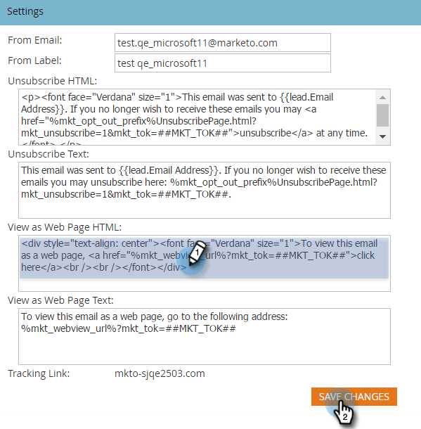

# Modifica il messaggio "Visualizza come pagina web" {#edit-the-view-as-web-page-message}

Se devi modificare il "[Visualizza come pagina Web](/help/marketo/product-docs/email-marketing/general/functions-in-the-editor/add-a-view-as-web-page-link-to-an-email.md)"text, ecco come.

>[!NOTE]
>
>**Autorizzazioni amministratore richieste**

## Modifica il messaggio "Visualizza come pagina web" {#edit-the-view-as-web-page-message-1}

1. Vai a **[!UICONTROL Amministratore]** area.

   

1. Clic **[!UICONTROL E-mail]**.

   

   >[!CAUTION]
   >
   >Le seguenti variabili sono critiche. Non eliminarle!
   >
   >`%mkt_webview_url%?mkt_tok=##MKT_TOK##`
   >
   >La seconda parte `##MKT_TOK##` è il [!UICONTROL munchkin] cookie di quella persona. Si assicura che vengano cookie in modo appropriato quando fanno clic sul collegamento.

1. Modifica il **[!UICONTROL Visualizza come Web Page HTML]** e **[!UICONTROL Visualizza come testo pagina Web]** versioni desiderate e fare clic su **[!UICONTROL Salva modifiche]**.

   

>[!CAUTION]
>
>Assicurati di evitare:
>
>* Aggiunta di URL aggiuntivi a una delle caselle di HTML
>* Inserimento di HTML nella versione di testo

Eccola qui. Invia e-mail di test per garantire la formattazione.

## Testo predefinito "Visualizza come pagina Web" {#default-view-as-web-page-text}

Se hai bisogno di tornare al sistema predefinito "[!UICONTROL Visualizza come pagina Web]", copia/incolla quanto segue:

**[!UICONTROL Visualizza come Web Page HTML]**:

`<pre data-theme="Confluence">
To view this email as a web page, <a href="%mkt_webview_url%?mkt_tok=##MKT_TOK##">click here</a>
</pre>`

**[!UICONTROL Visualizza come testo pagina Web]**:

Per visualizzare questa e-mail come pagina Web, vai al seguente indirizzo:
`<pre data-theme="Confluence">%mkt_webview_url%?mkt_tok=##MKT_TOK##</pre>`

Tutto qui!
