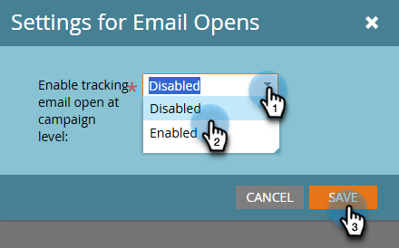

# Tracciamento dell’apertura delle e-mail a livello di campagna {#email-open-tracking-at-campaign-level}

Questa funzione ti consente di controllare il tracciamento delle aperture delle e-mail, una volta per ogni apertura in una campagna o una sola volta per ogni e-mail, indipendentemente dal numero di volte in cui viene utilizzata in diverse campagne.

>[!NOTE]
>
>**Autorizzazioni amministratore richieste**

1. Vai all&#39;area **Amministratore**.

   

1. Fai clic su **Smart Campaign**.

   

1. Accanto a _Impostazioni per aperture e-mail_, fai clic su **Modifica**.

   

1. Fai clic sull&#39;elenco a discesa, scegli l&#39;impostazione desiderata e fai clic su **Salva**.

   

<table><tbody>
  <tr>
    <td><b>Abilitata</b></td>
    <td>Le aperture delle e-mail vengono tracciate separatamente per ogni campagna.</td>
  </tr>
  <tr>
    <td><b>Disabilitata</b></td>
    <td>Le aperture dei messaggi e-mail vengono conteggiate solo in base alle aperture univoche di persone.</td>
  </tr>
</tbody>
</table>
