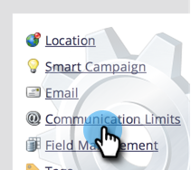

# Abilita limiti di comunicazione {#enable-communication-limits}

È molto importante non comunicare troppo con le persone. L’impostazione dei limiti di comunicazione impedirà alla tua organizzazione di inviare troppe e-mail.

>[!NOTE]
>
>**Autorizzazioni amministratore richieste**

1. Vai a **Amministratore** area.

   

1. Fai clic su **Limiti di comunicazione**.

   

1. Fai clic su **Modifica**.

   

   >[!NOTE]
   >
   >Al giorno si basa sul giorno del calendario nel fuso orario dell’abbonamento (mezzanotte-mezzanotte).

1. Fai clic sul pulsante **Al giorno** e seleziona il limite desiderato. In questo esempio scegliamo 1.

   

   >[!TIP]
   >
   >Puoi anche scegliere **Personalizzato** se nessuna delle opzioni preimpostate funziona.

1. Fai clic sul pulsante **Per 7 giorni** e seleziona il limite desiderato. In questo esempio scegliamo 5.

   

1. Seleziona **Blocca e-mail non operative**.

   

   >[!NOTE]
   >
   >Ulteriori informazioni su cosa [e-mail operative](/help/marketo/product-docs/email-marketing/general/functions-in-the-editor/make-an-email-operational.md) sono.

1. Fai clic su **Salva**.

   

   >[!NOTE]
   >
   >**Esempio**
   >
   >Le impostazioni di cui sopra indicano che le persone non riceveranno più di **1 e-mail al giorno** o più di **5 in un periodo di sette giorni**.

   >[!NOTE]
   >
   >I limiti di comunicazione si applicano automaticamente a tutti i programmi di e-mail e di coinvolgimento.

>[!MORELIKETHIS]
>
>[Applicare limiti di comunicazione a Smart Campaign](/help/marketo/product-docs/core-marketo-concepts/smart-campaigns/using-smart-campaigns/apply-communication-limits-to-smart-campaign.md)
