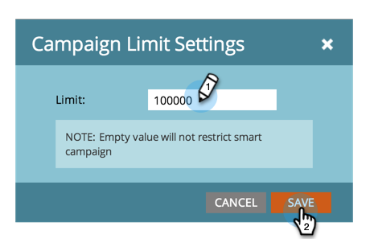

# Abilitare restrizioni persona per campagne avanzate {#enable-person-restrictions-for-smart-campaigns}

In Marketo è disponibile una funzione per limitare il numero massimo di _1&rbrace; persone che possono qualificarsi per una campagna avanzata._ In questo modo si evita di inviare accidentalmente e-mail all’intero database.

>[!NOTE]
>
>**Autorizzazioni amministratore richieste**

>[!CAUTION]
>
>Questo vale solo per le campagne batch e i programmi e-mail.

1. Passa alla schermata **[!UICONTROL Admin]**.

   

1. Fai clic su **[!UICONTROL Smart Campaign]**.

   

1. Fai clic su **[!UICONTROL Edit]**.

   

   >[!CAUTION]
   >
   >Se il numero di persone idonee per l’esecuzione in una campagna avanzata supera il limite impostato, non verrà eseguito affatto.

1. Immettere un limite e fare clic su **[!UICONTROL Save]**.

   

   >[!TIP]
   >
   >Disattiva questa funzione rendendo vuoto il campo.

   >[!CAUTION]
   >
   >Questo limite viene applicato a tutte le campagne avanzate, ma può essere ignorato a livello di campagna. Scopri come [ignorare le restrizioni personali in una campagna avanzata](/help/marketo/product-docs/core-marketo-concepts/smart-campaigns/using-smart-campaigns/override-person-restrictions-in-a-smart-campaign.md).

>[!MORELIKETHIS]
>
>[Ignorare le restrizioni per le persone in una campagna avanzata](/help/marketo/product-docs/core-marketo-concepts/smart-campaigns/using-smart-campaigns/override-person-restrictions-in-a-smart-campaign.md)
