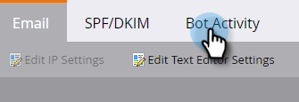
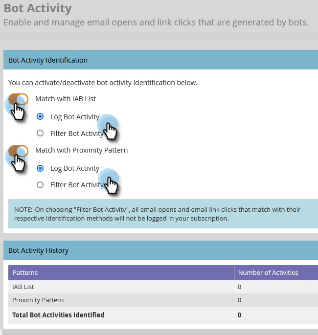
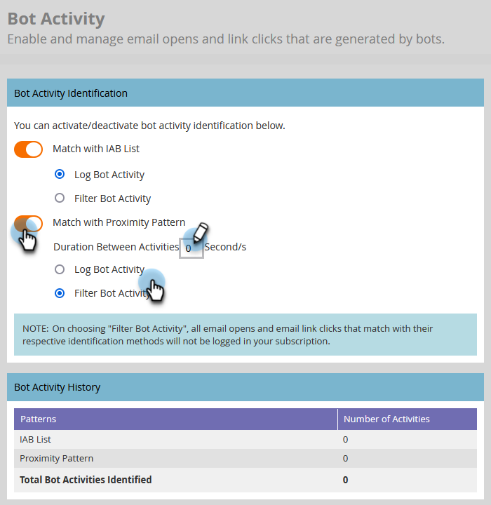

# Filtrare l’attività bot dell’e-mail {#filtering-email-bot-activity}

A volte, l’attività di bot su e-mail può erroneamente gonfiare le aperture delle e-mail e fare clic sui dati. Per risolvere il problema, segui la procedura riportata di seguito.

Per confermare l’attività bot vengono utilizzati due metodi separati:

* Corrispondenza con [Elenco bot di Interactive Advertising Bureau](https://www.iab.com/guidelines/iab-abc-international-spiders-bots-list/){target="_blank"}: le attività che corrispondono a qualsiasi elemento nell&#39;elenco IAB UA/IP (agente utente/indirizzo IP) verranno contrassegnate come bot.
* Corrispondenza con pattern di prossimità: quando due o più attività si verificano contemporaneamente (in meno di un secondo), vengono identificate come bot. Attributi considerati durante il confronto:
   * ID lead (deve essere lo stesso)
   * Risorsa e-mail (deve essere la stessa)
   * Clic collegamento o apertura e-mail
   * Differenza di tempo (deve essere inferiore a un secondo)

A seconda del clic sul collegamento e-mail e dell’attività di apertura e-mail, i nuovi attributi verranno compilati con i valori seguenti:

* Le attività identificate come bot avranno &quot;Bot Activity&quot; come &quot;True&quot; e &quot;Bot Activity Pattern&quot; come modello/metodo identificato
* Le attività identificate come non bot avranno &quot;Bot Activity&quot; come &quot;False&quot; e &quot;Bot Activity Pattern&quot; come &quot;N/D&quot;
* Le attività che si sono verificate prima dell’introduzione di questi attributi avranno &quot;Attività bot&quot; come &quot;&quot; (vuoto) e &quot;Modello di attività bot&quot; come &quot;&quot; (vuoto)

## Seleziona tipo di filtro {#select-filter-type}

1. Fai clic su **[!UICONTROL Admin]**.

   

1. Fai clic su **[!UICONTROL Email]**.

   

1. Fai clic sulla scheda **[!UICONTROL Bot Activity]**.

   

1. Sono disponibili due cursori tra cui scegliere. Puoi abilitare solo uno o entrambi. Se abiliti **[!UICONTROL Match with IAB List]**, scegli se [!UICONTROL log bot activity] _o_ [!UICONTROL filter bot activity].

   

1. Se abiliti **[!UICONTROL Match with Proximity Pattern]**, scegli se [!UICONTROL log bot activity] _o_ [!UICONTROL filter bot activity]. Puoi anche impostare il numero di secondi per **Durata tra le attività** (il valore predefinito è 0, il massimo è 3).

   

>[!NOTE]
>
>Con **Durata tra attività** impostata su 0 secondi, le attività e-mail verranno identificate come eseguite nello stesso secondo. Se si verificano più attività e-mail entro il numero di secondi specificato, queste vengono identificate come attività bot.

>[!IMPORTANT]
>
>* Se si sceglie [!UICONTROL Filter Bot Activity], è possibile che venga visualizzato un calo nelle aperture dei messaggi di posta elettronica e nei clic quando vengono rimosse le attività false.

**PASSAGGIO FACOLTATIVO**: per disattivare una delle due funzionalità, deselezionare il relativo dispositivo di scorrimento. In tal caso, i dati non vengono ripristinati.

>[!TIP]
>
>Utilizza i dati delle attività bot negli elenchi avanzati tramite i filtri booleani &quot;Is Bot Activity&quot; (sì/no) e &quot;Bot Activity Pattern&quot; nei filtri &quot;Clicked Link in Email&quot; (Collegamento cliccato in e-mail) e &quot;Open Email&quot; (Apri e-mail) e i trigger &quot;Clicks Link in Email&quot; (Collegamento clic in e-mail) e &quot;Opens Email&quot; (Apri e-mail).

## INSERIRE NELL&#39;ELENCO BLOCCATI IP {#ip-blocklist}

Marketo ha compilato un elenco di indirizzi IP responsabili della generazione di milioni di falsi impegni. Di conseguenza, qualsiasi coinvolgimento ricevuto dai seguenti IP viene automaticamente escluso e non aggiunto all’abbonamento a Marketo Engage. Questo può comportare una riduzione delle aperture delle e-mail, dei clic e di altre attività correlate. L&#39;elenco in appresso può essere aggiornato periodicamente.

* 40.94.34.52
* 40.94.34.86
* 52.34.76.65
* 54.70.53.60
* 54.71.187.124
* 60.28.2.248
* 64.235.150.252
* 64.235.153.10
* 64.235.153.2
* 64.235.154.105
* 64.235.154.109
* 64.235.154.140
* 64.74.215.1
* 64.74.215.100
* 64.74.215.138
* 64.74.215.139
* 64.74.215.142
* 64.74.215.146
* 64.74.215.150
* 64.74.215.154
* 64.74.215.158
* 64.74.215.162
* 64.74.215.164
* 64.74.215.166
* 64.74.215.170
* 64.74.215.174
* 64.74.215.176
* 64.74.215.178
* 64.74.215.51
* 64.74.215.56
* 64.74.215.58
* 64.74.215.59
* 64.74.215.86
* 64.74.215.98
* 65.154.226.101
* 66.249.91.149
* 70.42.131.106
* 74.125.217.116
* 74.217.90.250
* 104.129.41.4
* 104.47.55.126
* 104.47.58.126
* 104.47.70.126
* 104.47.73.126
* 104.47.73.254
* 104.47.74.126
* 128.220.160.1
* 155.70.39.101
* 162.129.251.14
* 162.129.251.42
* 208.52.157.204

>[!NOTE]
>
>Ogni indirizzo IP viene esaminato attentamente prima di essere aggiunto a questo elenco, garantendo che vengano bloccati solo gli IP più dannosi.
