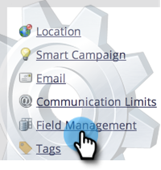

# Aggiornamenti dei campi di blocco durante l&#39;importazione dell&#39;elenco da origini non attendibili {#block-field-updates-during-list-import-from-untrusted-sources}

È possibile considerare attendibili i dati in alcuni elenchi più di altri. A volte si dispone di dati discutibili e si desidera accettarli se il campo è vuoto, ma non se esiste un valore esistente. Per eseguire questa operazione, blocca gli aggiornamenti dei campi sui campi chiave.

>[!NOTE]
>
>**Autorizzazioni amministratore richieste**

## Blocco Degli Aggiornamenti Dei Campi Da Origini Non Attendibili {#blocking-field-updates-from-untrusted-sources}

1. Vai a **Amministratore** area.

   

1. Fai clic su **Gestione dei campi**.

   

1. Trovare il campo desiderato, selezionarlo, quindi sotto **Azioni campo**, fai clic su **Aggiornamenti dei campi di blocco**.

   

1. Controlla **Importa elenco sorgente non attendibile** e fai clic su **Applica**.

   

>[!TIP]
>
>È possibile proteggere i campi da tutti gli elenchi, affidabili e non attendibili, anche selezionando **Importa elenco fonti attendibili**.

Ripetere i passaggi precedenti per tutti gli altri campi che si desidera proteggere dagli elenchi non attendibili.

## Esecuzione di un&#39;importazione di elenchi non attendibile {#running-an-untrusted-list-import}

1. Quando esegui l’importazione dell’elenco, assicurati di selezionare **Non attendibile** se desideri che tutti i campi impostati nel passaggio precedente siano sicuri.

   

Per istruzioni dettagliate sull’importazione degli elenchi, consulta [Importare un elenco di persone](/help/marketo/getting-started/quick-wins/import-a-list-of-people.md).

Ottimo lavoro! Ora è possibile proteggere i campi chiave da elenchi non attendibili.
