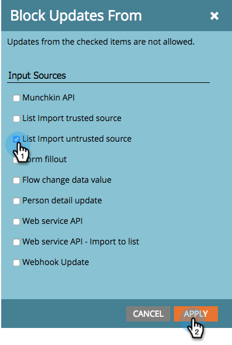

# Bloccare aggiornamenti dei campi durante l’importazione degli elenchi da origini non attendibili {#block-field-updates-during-list-import-from-untrusted-sources}

In alcuni elenchi è possibile considerare attendibili i dati più di altri. A volte si hanno dati discutibili e si desidera accettare i dati se il campo è vuoto, ma non se è presente un valore esistente. Per farlo, blocca gli aggiornamenti dei campi nei campi chiave.

>[!NOTE]
>
>**Autorizzazioni amministratore richieste**

## Blocco Degli Aggiornamenti Dei Campi Da Origini Non Attendibili {#blocking-field-updates-from-untrusted-sources}

1. Passa alla schermata **[!UICONTROL Admin]**.

   

1. Fai clic su **[!UICONTROL Field Management]**.

   

1. Individuare il campo desiderato, selezionarlo, quindi in **[!UICONTROL Field Actions]** fare clic su **[!UICONTROL Block Field Updates]**.

   

1. Selezionare **[!UICONTROL List Import untrusted source]** e fare clic su **[!UICONTROL Apply]**.

   

>[!TIP]
>
>È possibile proteggere i campi da tutti gli elenchi, attendibili e non attendibili, selezionando anche **[!UICONTROL List Import trusted source]**.

Ripetere i passaggi precedenti per tutti gli altri campi che si desidera proteggere dagli elenchi non attendibili.

## Esecuzione di un&#39;importazione di elenchi non attendibili {#running-an-untrusted-list-import}

1. Quando esegui l&#39;importazione dell&#39;elenco, assicurati di selezionare **[!UICONTROL Untrusted]** se desideri che tutti i campi configurati nel passaggio precedente siano sicuri.

   

Per istruzioni dettagliate sull&#39;importazione degli elenchi, vedere [Importare un elenco di persone](/help/marketo/getting-started/quick-wins/import-a-list-of-people.md).

I campi chiave sono ora protetti dalle importazioni di elenchi non attendibili.
