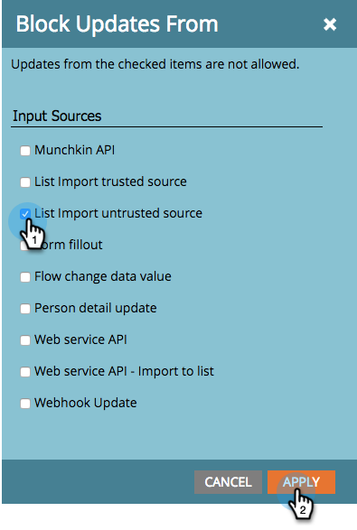

# Blocca aggiornamenti dei campi durante l&#39;importazione degli elenchi da origini non attendibili {#block-field-updates-during-list-import-from-untrusted-sources}

In alcuni elenchi è possibile considerare attendibili i dati più di altri. A volte si hanno dati discutibili e si desidera accettarli se il campo è vuoto, ma non se è presente un valore esistente. Per farlo, blocca gli aggiornamenti dei campi nei campi chiave.

>[!NOTE]
>
>**Autorizzazioni amministratore richieste**

## Blocco Degli Aggiornamenti Dei Campi Da Origini Non Attendibili {#blocking-field-updates-from-untrusted-sources}

1. Vai a **[!UICONTROL Amministratore]** area.

   

1. Clic **[!UICONTROL Gestione dei campi]**.

   

1. Individuare il campo desiderato, selezionarlo, quindi in **[!UICONTROL Azioni campo]**, fai clic su **[!UICONTROL Blocca aggiornamenti campi]**.

   

1. Verifica **[!UICONTROL Origine non attendibile importazione elenco]** e fai clic su **[!UICONTROL Applica]**.

   

>[!TIP]
>
>È possibile proteggere i campi da tutti gli elenchi, attendibili e non attendibili, selezionando anche **[!UICONTROL Origine attendibile importazione elenco]**.

Ripetere i passaggi precedenti per tutti gli altri campi che si desidera proteggere dagli elenchi non attendibili.

## Esecuzione di un&#39;importazione di elenchi non attendibili {#running-an-untrusted-list-import}

1. Durante l’importazione dell’elenco, assicurati di selezionare **[!UICONTROL Non attendibile]** se si desidera che tutti i campi impostati nel passaggio precedente siano sicuri.

   

Per istruzioni dettagliate sull&#39;importazione degli elenchi, vedere [Importa un elenco di persone](/help/marketo/getting-started/quick-wins/import-a-list-of-people.md).

Ottimo lavoro. Ora sai come proteggere i campi chiave dagli elenchi non attendibili.
