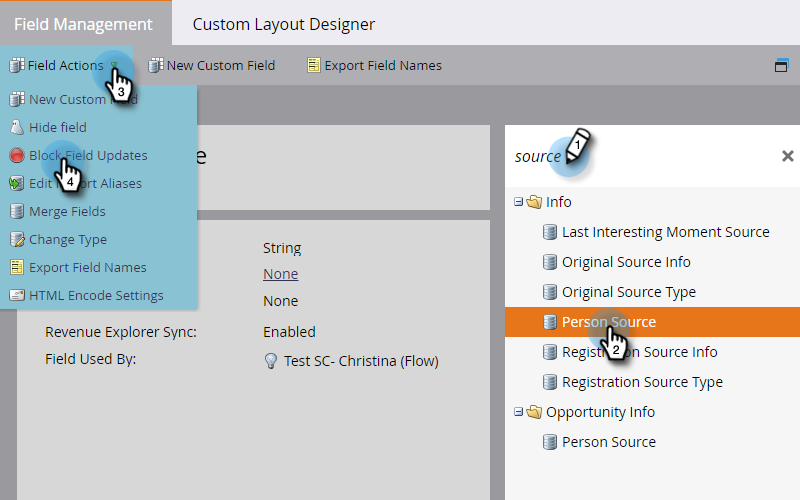

# Blocca aggiornamenti a un campo {#block-updates-to-a-field}

Il blocco degli aggiornamenti a un campo consente di scrivere una sola volta nel campo e quindi di mantenere il valore originale per la durata del campo. Può essere utile per un campo come Origine persona.

>[!NOTE]
>
>**Autorizzazioni amministratore richieste**

1. Vai a **Amministratore** e fai clic su **Gestione campi**.

   

1. Trova il campo, selezionalo, quindi in **Azioni campo** fai clic su **Blocca aggiornamenti campo**.

   

   >[!NOTE]
   >
   >È possibile bloccare anche gli aggiornamenti a [Campi personalizzati dei membri del programma](/help/marketo/product-docs/core-marketo-concepts/programs/working-with-programs/program-member-custom-fields.md).

1. Selezionare le **Origini di input** che si desidera bloccare e fare clic su **Applica**.

   

   >[!CAUTION]
   >
   >Durante l’importazione di un elenco, lo stato di un campo bloccato nell’anteprima importazione viene visualizzato solo se il campo viene riconosciuto automaticamente da Marketo in base al nome del campo corrispondente _esattamente_ (o se sono stabiliti alias). Se il campo viene selezionato manualmente dal menu a discesa Campo Marketo, lo stato bloccato non verrà visualizzato nell’anteprima di importazione, ma il blocco dell’aggiornamento a tale campo verrà comunque implementato.
