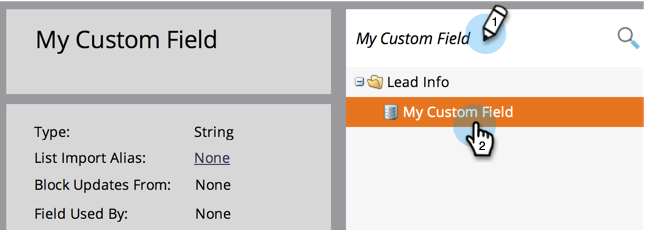
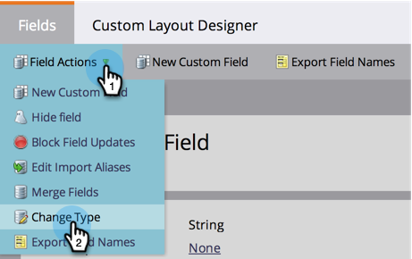

# Modificare il tipo di campo personalizzato Marketo {#change-the-type-of-a-marketo-custom-field}

Come modificare il tipo di campo di un campo personalizzato.

1. Vai a **Amministratore** e fai clic su **Gestione campi**.

   

1. Trova e seleziona il campo desiderato.

   

1. Nel menu a discesa **Azioni campo**, fai clic su **Cambia tipo**.

   

1. Seleziona il nuovo tipo.

   >[!NOTE]
   >
   >Impossibile modificare i campi punteggio e formula.

   

1. Leggere l&#39;avviso, quindi fare clic su **Cambia** per confermare.

   

   >[!NOTE]
   >
   >Il messaggio di avviso visualizzato varia a seconda del tipo di campo da/a.

   >[!MORELIKETHIS]
   >
   >[Creare un campo personalizzato in Marketo](/help/marketo/product-docs/administration/field-management/create-a-custom-field-in-marketo.md)
