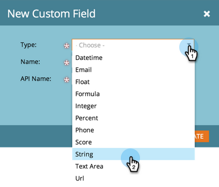

# Creare un campo personalizzato in Marketo {#create-a-custom-field-in-marketo}

Scopri come creare un campo personalizzato in Marketo Engage per archiviare e acquisire dati.

1. Passa alla schermata **[!UICONTROL Admin]**.

   

1. Fai clic su **[!UICONTROL Field Management]**.

   

   >[!TIP]
   >
   >Se desideri che i campi siano sincronizzati con il CRM, creali nel CRM e verranno creati automaticamente in Marketo.

1. Fai clic su **[!UICONTROL New Custom Field]**.

   

1. Scegliere _[!UICONTROL Object]_.

   

   >[!NOTE]
   >
   >Anche se non sei in grado di selezionare l&#39;oggetto _Company_ da solo, puoi richiederlo contattando il [supporto Marketo](https://nation.marketo.com/t5/support/ct-p/Support){target="_blank"}.

1. Scegliere il campo _[!UICONTROL Type]_. Questo cambierà il modo in cui viene riprodotto negli elenchi avanzati e nei moduli in Marketo.

   >[!TIP]
   >
   >Consulta il [Glossario dei tipi di campo personalizzati](/help/marketo/product-docs/administration/field-management/custom-field-type-glossary.md){target="_blank"}.

   

1. Immettere _[!UICONTROL Name]_&#x200B;come si desidera che venga visualizzato in Marketo (_[!UICONTROL API Name]_ viene generato automaticamente). Scegli con attenzione, poiché non può essere rinominato dopo il salvataggio. Al termine, fai clic su **[!UICONTROL Create]**.

>[!CAUTION]
>
>I nomi dei campi non possono iniziare con i seguenti caratteri: **. &amp; +[]**

>[!NOTE]
>
>Il nome API viene utilizzato dall’API SOAP e da altri processi di back-end.

È ora possibile utilizzare questo campo personalizzato in maschere, passaggi di flusso ed elenchi avanzati.
