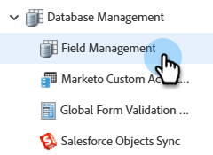

# Creare un campo personalizzato in Marketo {#create-a-custom-field-in-marketo}

Se hai bisogno di un nuovo campo personalizzato in Marketo per memorizzare/acquisire dati, ecco come crearne uno.

1. Vai a **Amministratore** area.

   

1. Fai clic su **Gestione dei campi**.

   

   >[!TIP]
   >
   >Se desideri che i campi siano mantenuti sincronizzati con il tuo CRM, creali nel CRM e verranno creati automaticamente in Marketo.

1. Fai clic su **Nuovo campo personalizzato**.

   

1. Scegliere il tipo di campo. Questo cambierà il rendering negli elenchi smart e nei moduli in Marketo.

   >[!TIP]
   >
   >Consulta la sezione [Glossario dei tipi di campi personalizzati](/help/marketo/product-docs/administration/field-management/custom-field-type-glossary.md).

   

1. Immetti il Nome come desideri che appaia in Marketo. Il nome API viene generato automaticamente. È possibile modificarla, ma non può essere rinominata una volta impostata. Fai clic su **Crea** al termine.

>[!CAUTION]
>
>I nomi dei campi non possono iniziare con i seguenti caratteri: **. &amp; +[]**

>[!NOTE]
>
>Il nome API viene utilizzato dall’API SOAP e da altri processi di back-end.

È ora possibile utilizzare questo campo personalizzato in moduli, passaggi di flusso ed elenchi avanzati.
