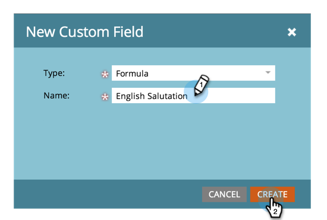

# Creare e utilizzare un campo (formula) Stringa concatenata {#create-and-use-a-concatenated-string-formula-field}

È possibile combinare valori provenienti da più campi o creare un valore condizionale utilizzando un campo formula di Marketo Engage.

1. Passa alla schermata **[!UICONTROL Admin]**.

   

1. Fai clic su **[!UICONTROL Field Management]**.

   

1. Fai clic su **[!UICONTROL New Custom Field]**.

   

1. Selezionare **[!UICONTROL Formula]** per **[!UICONTROL Type]**.

   

1. Immetti **[!UICONTROL Name]** per il campo, quindi fai clic su **[!UICONTROL Create]**.

   

1. Trovare e selezionare il campo formula, quindi fare clic su **[!UICONTROL Edit Rules]**.

   

1. Aggiungi due scelte e definiscili come nella schermata seguente.

   

   >[!TIP]
   >
   >Ulteriori informazioni sui [token per i passaggi del flusso](/help/marketo/product-docs/core-marketo-concepts/smart-campaigns/flow-actions/use-tokens-in-flow-steps.md).

1. Ora puoi aggiungere il campo formula come token in un messaggio e-mail.

   

>[!NOTE]
>
>I campi formula possono essere utilizzati nelle colonne Pagine di destinazione, E-mail ed Elenco avanzato. Le e-mail con campi formula possono _non_ essere inviate utilizzando una campagna batch. In questo scenario, utilizza un [token di script e-mail](/help/marketo/product-docs/email-marketing/general/using-tokens/create-an-email-script-token.md).
