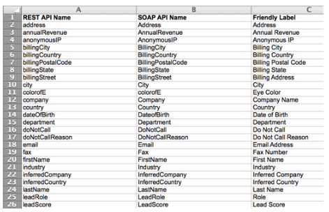

# Esporta un elenco di tutti i nomi di campo API di Marketo {#export-a-list-of-all-marketo-api-field-names}

Se utilizzi il nostro [!DNL SOAP API] o [!DNL Munchkin API] è necessario un elenco di tutti i campi e dei relativi nomi API. Ecco come ottenere questa lista.

>[!NOTE]
>
>**Autorizzazioni amministratore richieste**

1. Vai a **[!UICONTROL Amministratore]** area.

   

1. Clic **[!UICONTROL Gestione dei campi]**.

   

1. Clic **[!UICONTROL Esporta nomi campi]** per scaricare il foglio di calcolo.

   

Bello! Ora disponi di un foglio di calcolo con un elenco di tutti i campi e dei relativi nomi API.

>[!NOTE]
>
>Il limite di caratteri per i nomi API MLM è 255.
