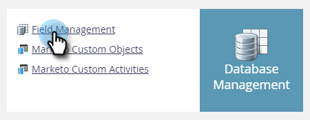

# Esportare tutti i metadati dell’oggetto {#export-all-object-metadata}

Questa funzione consente di esportare tutti gli oggetti e i relativi metadati.

>[!NOTE]
>
>**Autorizzazioni amministratore richieste**

## Oggetti {#objects}

* Campi lead (persona/società)
* Oggetti personalizzati di Marketo
* Attività standard
* Attività personalizzate
* Canali
* Tag

## Esporta metadati oggetto {#export-object-metadata}

1. Passa alla schermata **[!UICONTROL Admin]**.

   

1. Fai clic su **[!UICONTROL Field Management]**.

   

1. Fai clic su **[!UICONTROL Export All Objects]**.

   

>[!NOTE]
>
>Assicurati che il browser non blocchi i popup da Marketo.

I dati vengono esportati come file CSV.

