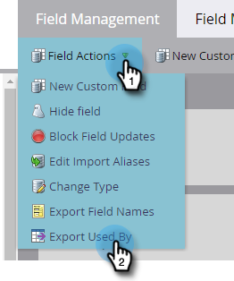

# Esportare Utilizzo da dati per un campo {#export-used-by-data-for-a-field}

In qualità di amministratore, puoi esportare le risorse correlate di un campo in modo da delegarne lo scollegamento al team.

>[!NOTE]
>
>**Autorizzazioni amministratore richieste**

1. Passa alla schermata **[!UICONTROL Admin]**.

   

1. Fai clic su **[!UICONTROL Field Management]**.

   

1. Trova il campo desiderato e selezionalo.

   

1. Fai clic sul menu a discesa **[!UICONTROL Field Actions]** e seleziona **[!UICONTROL Export Used By]**.

   

1. Verrà esportato un file [!DNL Excel]. Aprilo per visualizzarne il contenuto.

   

   >[!TIP]
   >
   >Ogni risorsa correlata è un collegamento su cui è possibile fare clic e che si aprirà in Marketo.
