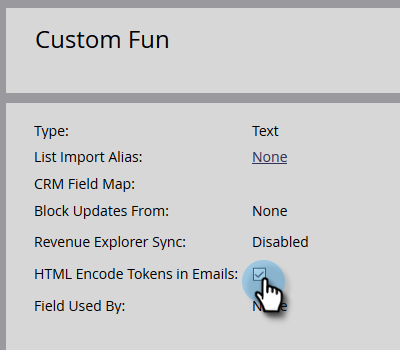

# Codificare token HTML nelle e-mail {#html-encode-tokens-in-emails}

Abilita/disabilita i token persona e azienda utilizzati nelle e-mail.

>[!NOTE]
>
>**Autorizzazioni amministratore richieste**

>[!NOTE]
>
>La codifica converte i caratteri nelle rispettive versioni del codice HTML per evitare confusione durante la trasmissione (ad esempio, &quot;&amp;&quot; viene modificato in `&amp;`). Per ulteriori informazioni, consulta il tuo sviluppatore web.

1. Passa alla schermata **[!UICONTROL Admin]**.

   

1. Fai clic su **[!UICONTROL Field Management]**.

   

1. Individuare e selezionare il campo desiderato.

   

1. Selezionare la casella **[!UICONTROL HTML Encode Tokens in Emails]** per attivare, deselezionare per disattivare.

   

   Ed è tutto! Puoi eseguire questa operazione per tutti i singoli campi desiderati.
