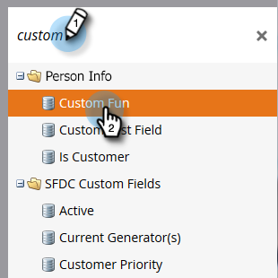

# Token di codifica HTML nelle e-mail {#html-encode-tokens-in-emails}

Attiva/disattiva i token utente e aziendali utilizzati nelle e-mail.

>[!NOTE]
>
>**Autorizzazioni amministratore richieste**

>[!NOTE]
>
>La codifica converte i caratteri nelle versioni del codice HTML per evitare confusione durante la trasmissione (ovvero &quot;&amp;&quot; viene modificato in `&amp;`). Per ulteriori informazioni, consulta lo sviluppatore web.

1. Vai a **Amministratore** area.

   

1. Fai clic su **Gestione dei campi**.

   

1. Trova e seleziona il campo desiderato.

   

1. Controlla la **Token di codifica HTML nelle e-mail** deseleziona per disattivare.

   

   Ed è tutto! È possibile eseguire questa operazione per tutti i campi singoli desiderati.
