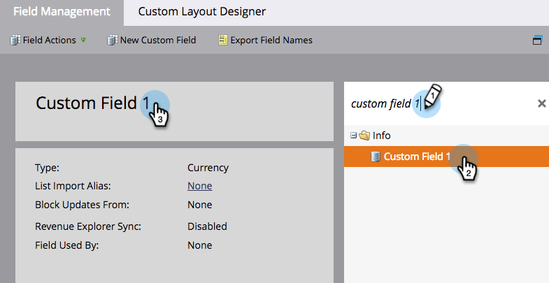

# Rinominare un campo {#rename-a-field}

>[!NOTE]
>
>È possibile rinominare un campo personalizzato in Marketo. Tuttavia, è necessario rimuoverne tutto l&#39;uso nel sistema prima di farlo. Ciò include moduli, elenchi avanzati e campagne avanzate.

>[!NOTE]
>
>**Autorizzazioni amministratore richieste**

1. Passa alla schermata **[!UICONTROL Admin]**.

   

1. Fai clic su **[!UICONTROL Field Management]**.

   

1. Trova e seleziona il campo da rinominare, quindi fai clic sul nome del campo nell’area di lavoro.

   

   >[!TIP]
   >
   >Fai clic sul collegamento **[!UICONTROL Used By]** per trovare le risorse che fanno riferimento a questo campo.

1. Rinominare il campo e fare clic su **[!UICONTROL Save]**.

   

Ora sai come rinominare i campi in Marketo.

>[!CAUTION]
>
>Se si rinomina il nome API in [!DNL Salesforce], Marketo creerà un nuovo campo e lascerà indietro quello precedente.
