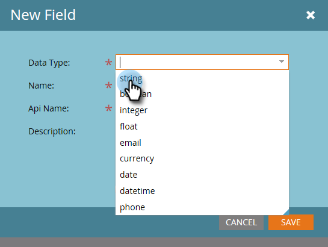

# Aggiungi/Modifica/Elimina campi attività personalizzati Marketo {#add-edit-delete-marketo-custom-activity-fields}

Potrebbe essere necessario aggiungere, modificare o persino eliminare un campo di attività personalizzato. Ecco come.

## Aggiungi un campo di attività personalizzato {#add-a-custom-activity-field}

1. Vai a **Amministratore** area.

   

1. Fai clic su **Attività personalizzate Marketo**.

   

1. Fai clic su **Campi**.

   

1. Seleziona l’attività personalizzata a cui desideri aggiungere un campo.

   

1. Fai clic su **Nuovo campo**.

   

1. Scegliere il tipo di dati del campo.

   

   >[!TIP]
   >
   >Non sei sicuro di cosa selezionare? Ti abbiamo coperto! Tutti i tipi di dati disponibili sono definiti in [articolo](/help/marketo/product-docs/administration/field-management/custom-field-type-glossary.md).

1. Denomina il campo. Il nome dell’Api viene compilato automaticamente. Al termine, fai clic su **Salva**.

   

   Tutto qui! Il nuovo campo è stato aggiunto.

## Modificare un campo di attività personalizzato {#edit-a-custom-activity-field}

1. Vai a **Amministratore** area.

   

1. Fai clic su **Attività personalizzate Marketo**.

   

1. Fai clic su **Campi**.

   

1. Seleziona l’attività personalizzata che contiene il campo da modificare.

   

1. Seleziona il campo da modificare, fai clic sul pulsante **Azioni campo** a discesa e seleziona **Modifica campo**.

   

   Viene visualizzata la finestra a comparsa Modifica campo. In questo esempio modifichiamo il nome del campo.

   

1. Immetti il nuovo nome e il nome dell&#39;Api, quindi fai clic su **Salva**.

   

   >[!NOTE]
   >
   >Il nome dell’Api non viene compilato automaticamente quando si modifica un campo. Anche se non è necessario che il Nome campo e il Nome Api corrispondano, si consiglia di farlo.

   >[!CAUTION]
   >
   >Puoi modificare il Nome Api o cambiare il campo in Primario solo se l’attività personalizzata non è mai stata pubblicata.

   >[!NOTE]
   >
   >Se si desidera modificare il campo primario, è innanzitutto necessario deselezionare quello esistente.

Il campo è ora modificato.

## Eliminare un campo di attività personalizzato {#delete-a-custom-activity-field}

1. Vai a **Amministratore** area.

   

1. Fai clic su **Attività personalizzate Marketo**.

   

1. Fai clic su **Campi**.

   

1. Seleziona l’attività personalizzata che contiene il campo da eliminare.

   

1. Seleziona il campo da eliminare, fai clic sul pulsante **Azioni campo** a discesa e seleziona **Elimina campo**.

   
