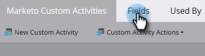

# Aggiungere, modificare o eliminare campi attività personalizzati di Marketo {#add-edit-delete-marketo-custom-activity-fields}

Scopri come aggiungere, modificare o rimuovere un campo attività personalizzato.

## Aggiungere un campo attività personalizzato {#add-a-custom-activity-field}

1. Passa alla schermata **[!UICONTROL Admin]**.

   

1. Fai clic su **[!UICONTROL Marketo Custom Activities]**.

   

1. Fai clic su **[!UICONTROL Fields]**.

   

1. Seleziona l’attività personalizzata a cui desideri aggiungere un campo.

   

1. Fai clic su **[!UICONTROL New Field]**.

   

1. Scegli il campo [!UICONTROL data type].

   

   >[!TIP]
   >
   >Per le definizioni di tutti i tipi di dati disponibili, vedere [questo articolo](/help/marketo/product-docs/administration/field-management/custom-field-type-glossary.md).

1. Denomina il campo. [!UICONTROL API Name] viene compilato automaticamente. Al termine, fare clic su **[!UICONTROL Save]**.

   

   Il nuovo campo è stato aggiunto.

## Modificare un campo attività personalizzato {#edit-a-custom-activity-field}

1. Passa alla schermata **[!UICONTROL Admin]**.

   

1. Fai clic su **[!UICONTROL Marketo Custom Activities]**.

   

1. Fai clic su **[!UICONTROL Fields]**.

   

1. Seleziona l’attività personalizzata che contiene il campo da modificare.

   

1. Selezionare il campo da modificare, fare clic sull&#39;elenco a discesa **[!UICONTROL Field Actions]** e selezionare **[!UICONTROL Edit Field]**.

   

   Viene visualizzata la finestra a comparsa **[!UICONTROL Edit Field]**. In questo esempio, il nome del campo viene modificato.

   

1. Immettere il nuovo nome e [!UICONTROL API Name], quindi fare clic su **[!UICONTROL Save]**.

   

   >[!NOTE]
   >
   >[!UICONTROL API Name] non verrà compilato automaticamente durante la modifica di un campo. Anche se non è necessario che il campo [!UICONTROL Name] e il campo [!UICONTROL API Name] corrispondano, Marketo consiglia di farlo.

   >[!CAUTION]
   >
   >È possibile modificare [!UICONTROL API Name] o cambiare il campo in Primario solo se l&#39;attività personalizzata non è mai stata pubblicata.

   >[!NOTE]
   >
   >Se si desidera modificare il campo Principale, è necessario innanzitutto deselezionare quello esistente.

Il campo è stato aggiornato.

## Eliminare un campo attività personalizzato {#delete-a-custom-activity-field}

1. Passa alla schermata **[!UICONTROL Admin]**.

   

1. Fai clic su **[!UICONTROL Marketo Custom Activities]**.

   

1. Fai clic su **[!UICONTROL Fields]**.

   

1. Seleziona l’attività personalizzata che contiene il campo da eliminare.

   

1. Selezionare il campo da eliminare, fare clic sull&#39;elenco a discesa **[!UICONTROL Field Actions]** e selezionare **[!UICONTROL Delete Field]**.

   
