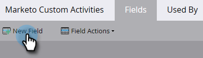

# Aggiungi/Modifica/Elimina campi attività personalizzati di Marketo {#add-edit-delete-marketo-custom-activity-fields}

Potrebbe essere necessario aggiungere, modificare o anche eliminare un campo attività personalizzato. Ecco come.

## Aggiungere un campo attività personalizzato {#add-a-custom-activity-field}

1. Vai a **[!UICONTROL Amministratore]** area.

   

1. Clic **[!UICONTROL Attività personalizzate Marketo]**.

   

1. Clic **[!UICONTROL Campi]**.

   

1. Seleziona l’attività personalizzata a cui desideri aggiungere un campo.

   

1. Clic **[!UICONTROL Nuovo campo]**.

   

1. Scegli il campo [!UICONTROL tipo di dati].

   

   >[!TIP]
   >
   >Non sei sicuro di cosa selezionare? Ti copriamo! Tutti i tipi di dati disponibili sono definiti in [questo articolo](/help/marketo/product-docs/administration/field-management/custom-field-type-glossary.md).

1. Denomina il campo. Il nome API si compila automaticamente. Al termine, fai clic su **[!UICONTROL Salva]**.

   

   Tutto qui! Il nuovo campo è stato aggiunto.

## Modificare un campo attività personalizzato {#edit-a-custom-activity-field}

1. Vai a **[!UICONTROL Amministratore]** area.

   

1. Clic **[!UICONTROL Attività personalizzate Marketo]**.

   

1. Clic **[!UICONTROL Campi]**.

   

1. Seleziona l’attività personalizzata che contiene il campo da modificare.

   

1. Seleziona il campo da modificare, fai clic su **[!UICONTROL Azioni campo]** e selezionare **[!UICONTROL Modifica campo]**.

   

   Viene visualizzata la finestra a comparsa Modifica campo. In questo esempio modifichiamo il nome del campo.

   

1. Inserisci il nuovo Nome e Nome API, quindi fai clic su **[!UICONTROL Salva]**.

   

   >[!NOTE]
   >
   >Il Nome API non viene compilato automaticamente durante la modifica di un campo. Anche se non è necessario che il Nome campo e il Nome API corrispondano, consigliamo di farlo.

   >[!CAUTION]
   >
   >Puoi modificare il Nome API o cambiare il campo in Primario solo se l’attività personalizzata non è mai stata pubblicata.

   >[!NOTE]
   >
   >Se si desidera modificare il campo Principale, è necessario innanzitutto deselezionare quello esistente.

Il campo è stato modificato.

## Eliminare un campo attività personalizzato {#delete-a-custom-activity-field}

1. Vai a **[!UICONTROL Amministratore]** area.

   

1. Clic **[!UICONTROL Attività personalizzate Marketo]**.

   

1. Clic **[!UICONTROL Campi]**.

   

1. Seleziona l’attività personalizzata che contiene il campo da eliminare.

   

1. Seleziona il campo da eliminare, fai clic sul pulsante **[!UICONTROL Azioni campo]** e selezionare **[!UICONTROL Elimina campo]**.

   
