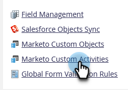
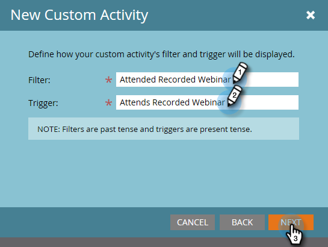

# Creare un’attività personalizzata {#create-a-custom-activity}

Per creare una nuova attività personalizzata, segui la procedura riportata di seguito.

>[!NOTE]
>
>La maggior parte degli abbonamenti dispone di un limite allocato di 10 tipi di attività personalizzate.

1. Passa alla schermata **[!UICONTROL Admin]**.

   

1. Fai clic su **[!UICONTROL Marketo Custom Activities]**.

   

1. Fai clic su **[!UICONTROL New Custom Activity]**.

   

1. Immettere un nome e [!UICONTROL Description] facoltativi, quindi fare clic su **[!UICONTROL Next]**. Il Nome API viene compilato automaticamente, ma può essere personalizzato.

   

   >[!CAUTION]
   >
   >Se decidi di modificare [!UICONTROL API Name], assicurati che il nome non sia in conflitto con i campi di altre attività personalizzate.

1. Definisci [!UICONTROL Filter] e [!UICONTROL Trigger] e fai clic su **[!UICONTROL Next]**.

   

1. Assegna al campo principale un **[!UICONTROL Name]** che riepiloghi lo scopo dell&#39;attività personalizzata.

   

>[!MORELIKETHIS]
>
>[Informazioni sulle attività personalizzate](/help/marketo/product-docs/administration/marketo-custom-activities/understanding-custom-activities.md)
