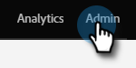
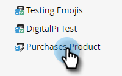
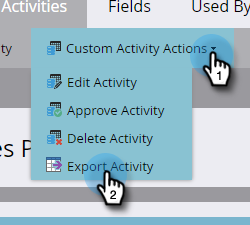

# Esportare metadati delle attività personalizzate {#custom-activity-metadata-export}

Segui i passaggi seguenti per esportare lo schema metadati attività personalizzato.

1. In Il mio Marketo, fai clic su **[!UICONTROL Admin]**.

   

1. Fai clic su **[!UICONTROL Marketo Custom Activities]**.

   

1. Seleziona l’attività personalizzata Marketo da esportare.

   

1. Fai clic sul menu a discesa **[!UICONTROL Custom Activity Actions]** e seleziona **[!UICONTROL Export Activity]**.

   

>[!NOTE]
>
>L&#39;attività personalizzata deve essere nello stato Approvato per essere esportata.

Ora disponi di un foglio di calcolo con lo schema dell’attività personalizzata, suddiviso in tre schede.
