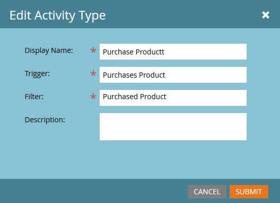

# Modificare un’attività personalizzata {#edit-a-custom-activity}

Vuoi apportare modifiche a un&#39;attività personalizzata già creata? Ecco come.

1. Vai a **[!UICONTROL Amministratore]** area.

   

1. Clic **[!UICONTROL Attività personalizzate Marketo]**.

   

1. Seleziona l’attività personalizzata da modificare.

   

1. Clic **[!UICONTROL Azioni attività personalizzate]** e seleziona **[!UICONTROL Modifica attività]**.

   

   Viene visualizzato Modifica tipo di attività. In questo esempio, stiamo correggendo un errore di battitura.

   

1. Immetti le nuove informazioni e fai clic su **[!UICONTROL Invia]**.

   

   L&#39;attività personalizzata è stata modificata.

   >[!NOTE]
   >
   >Se al momento della modifica l’attività era una bozza, rimane una bozza. Se è stata pubblicata, lo stato diventa Pubblicato con bozza.
