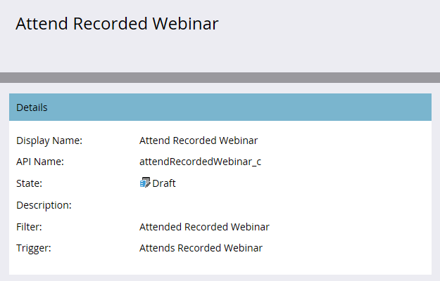

# Pubblicare un’attività personalizzata {#publish-a-custom-activity}

L’attività personalizzata si svolge esattamente come desideri. Ora è il momento di pubblicarlo!

1. Vai a **[!UICONTROL Amministratore]** area.

   

1. Clic **[!UICONTROL Attività personalizzate Marketo]**.

   

1. Seleziona l’attività personalizzata da pubblicare.

   

1. Fai clic su **[!UICONTROL Azioni attività personalizzate]** a discesa e selezionare **[!UICONTROL Attività di pubblicazione]**.

   

   Visualizzerai i [!UICONTROL stato] vai da [!UICONTROL Bozza]...

   

   ...a [!UICONTROL Pubblicato].

   

   Ben fatto!
