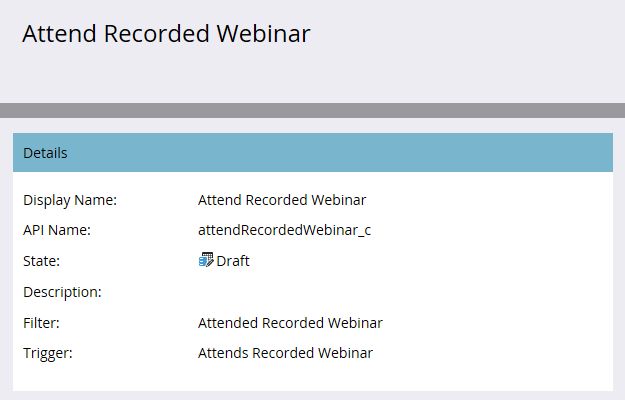

# Pubblicare un’attività personalizzata {#publish-a-custom-activity}

Scopri come pubblicare l’attività personalizzata.

1. Passa alla schermata **[!UICONTROL Admin]**.

   

1. Fai clic su **[!UICONTROL Marketo Custom Activities]**.

   

1. Seleziona l’attività personalizzata da pubblicare.

   

1. Fai clic sul menu a discesa **[!UICONTROL Custom Activity Actions]** e seleziona **[!UICONTROL Publish Activity]**.

   

   L&#39;attività personalizzata [!UICONTROL State] cambia da [!UICONTROL Draft]...

   

   ...a [!UICONTROL Published].

   
