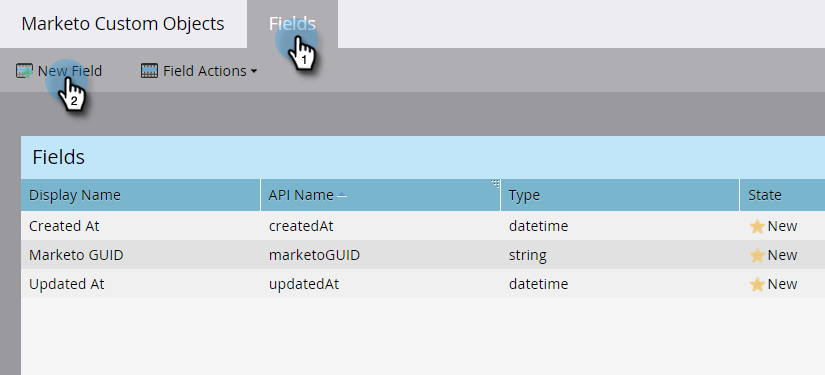

# Aggiungi campi oggetto personalizzati Marketo {#add-marketo-custom-object-fields}

Dopo aver creato un oggetto personalizzato, devi aggiungervi dei campi per soddisfare le tue esigenze aziendali.

I campi definiscono le informazioni specifiche utilizzate da un oggetto personalizzato. I campi di collegamento hanno un processo speciale per connettere oggetti personalizzati e sono trattati in un [articolo separato](/help/marketo/product-docs/administration/marketo-custom-objects/add-marketo-custom-object-link-fields.md).

1. Passare all&#39;area **[!UICONTROL Admin]**.

   

1. Fai clic su **[!UICONTROL Marketo Custom Objects]**.

   

1. Selezionare l&#39;oggetto a cui si desidera aggiungere il campo a destra.

   

1. Fare clic sulla scheda **[!UICONTROL Fields]**, quindi su **[!UICONTROL New Field]**.

   

   >[!NOTE]
   >
   >I tre campi mostrati sopra vengono creati automaticamente da Marketo quando si crea un oggetto personalizzato. Marketo gestisce questi campi automaticamente e non è possibile modificarli o eliminarli.

1. Immettere [!UICONTROL Display Name] e (facoltativo) [!UICONTROL Description].

   

   >[!NOTE]
   >
   >[!UICONTROL API Name] può essere modificato solo fino a quando non viene approvato.

1. Scegliere un [!UICONTROL Data Type] appropriato dall&#39;elenco.

   

1. Se desideri utilizzare il nuovo campo come identificatore univoco, trascina il cursore [!UICONTROL Dedupe]. Fai clic su **[!UICONTROL Save]** per terminare.

   

   >[!TIP]
   >
   >I campi di deduplicazione possono essere utilizzati per recuperare, aggiornare o eliminare oggetti personalizzati. Ogni definizione di oggetto personalizzato deve contenere almeno un campo di deduplicazione (e non più di tre).

1. Aggiungi tutti gli altri campi necessari.

   >[!NOTE]
   >
   >Se stai creando una struttura uno-a-molti, devi aggiungere un campo Collegamento all&#39;oggetto personalizzato. Per una struttura molti-a-molti, non è necessario un campo collegamento nell&#39;oggetto personalizzato, ma è necessario aggiungere due campi collegamento nell&#39;oggetto intermedio. Per ulteriori informazioni sui tipi di oggetti personalizzati, vedere [Aggiungere campi collegamento di oggetti personalizzati di Marketo](/help/marketo/product-docs/administration/marketo-custom-objects/add-marketo-custom-object-fields.md) per creare i campi collegamento e [Informazioni sugli oggetti personalizzati di Marketo](/help/marketo/product-docs/administration/marketo-custom-objects/understanding-marketo-custom-objects.md).

>[!MORELIKETHIS]
>
>* [Aggiungi campi collegamento oggetto personalizzato Marketo](/help/marketo/product-docs/administration/marketo-custom-objects/add-marketo-custom-object-link-fields.md)
>* [Modifica ed elimina un oggetto personalizzato di Marketo](/help/marketo/product-docs/administration/marketo-custom-objects/edit-and-delete-a-marketo-custom-object.md)
>* [Modifica ed elimina campi oggetto personalizzati di Marketo](/help/marketo/product-docs/administration/marketo-custom-objects/edit-and-delete-marketo-custom-object-fields.md)
>* [Informazioni sugli oggetti personalizzati di Marketo](/help/marketo/product-docs/administration/marketo-custom-objects/understanding-marketo-custom-objects.md)
