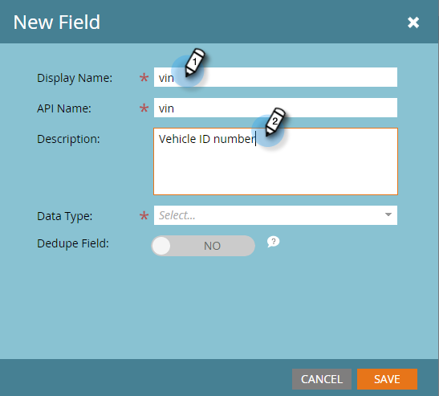

# Aggiungi campi oggetto personalizzati Marketo {#add-marketo-custom-object-fields}

Dopo aver creato un oggetto personalizzato, è necessario aggiungergli dei campi per soddisfare le esigenze aziendali.

I campi definiscono le informazioni specifiche utilizzate da un oggetto personalizzato. I campi di collegamento hanno un lavoro speciale, per collegare oggetti personalizzati e sono trattati in un [articolo separato](/help/marketo/product-docs/administration/marketo-custom-objects/add-marketo-custom-object-link-fields.md).

1. Vai a **Amministratore** area.

   

1. Fai clic su **Oggetti personalizzati Marketo**.

   

1. Selezionare l’oggetto a cui si desidera aggiungere il campo a destra.

   

1. In **Campi** scheda , fai clic su **Nuovo campo**.

   

   >[!NOTE]
   >
   >I tre campi indicati sopra vengono creati automaticamente da Marketo al momento della creazione di un oggetto personalizzato. Marketo gestisce automaticamente questi campi e non è possibile modificarli o eliminarli.

1. Immetti un nome e una descrizione visualizzati.

   

   >[!NOTE]
   >
   >Il nome dell’API può essere modificato solo fino all’approvazione.

1. A questo punto, scegli un tipo di dati appropriato dall’elenco.

   

1. Se desideri utilizzare il nuovo campo come identificatore univoco, solleva il cursore Dedupe. Fai clic su **Salva** per finire.

   

   >[!TIP]
   >
   >I campi di deduplicazione possono essere utilizzati per recuperare, aggiornare o eliminare oggetti personalizzati. Ogni definizione di oggetto personalizzato deve contenere almeno un campo di deduplicazione (e non più di tre).

1. Aggiungi tutti gli altri campi necessari.

   >[!NOTE]
   >
   >Se stai creando una struttura uno-a-molti, devi aggiungere un campo Collegamento all’oggetto personalizzato. Per una struttura molti-a-molti, non è necessario un campo di collegamento nell’oggetto personalizzato, ma è necessario aggiungere due campi di collegamento nell’oggetto intermedio. Vedi [Aggiungi campi di collegamento a oggetti personalizzati Marketo](/help/marketo/product-docs/administration/marketo-custom-objects/add-marketo-custom-object-fields.md) per creare i campi di collegamento e [Informazioni sugli oggetti personalizzati Marketo](/help/marketo/product-docs/administration/marketo-custom-objects/understanding-marketo-custom-objects.md) per ulteriori informazioni sui tipi di oggetti personalizzati.

>[!MORELIKETHIS]
>
>* [Aggiungi campi di collegamento a oggetti personalizzati Marketo](/help/marketo/product-docs/administration/marketo-custom-objects/add-marketo-custom-object-link-fields.md)
>* [Modificare ed eliminare un oggetto personalizzato Marketo](/help/marketo/product-docs/administration/marketo-custom-objects/edit-and-delete-a-marketo-custom-object.md)
>* [Modificare ed eliminare i campi oggetto personalizzati Marketo](/help/marketo/product-docs/administration/marketo-custom-objects/edit-and-delete-marketo-custom-object-fields.md)
>* [Informazioni sugli oggetti personalizzati Marketo](/help/marketo/product-docs/administration/marketo-custom-objects/understanding-marketo-custom-objects.md)

