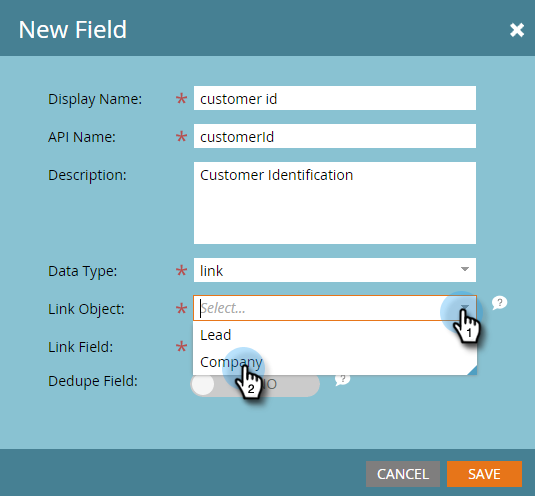
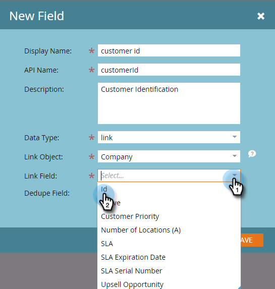
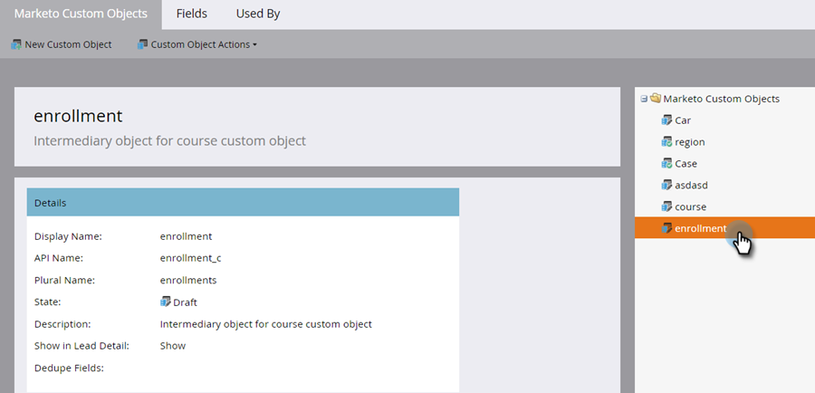
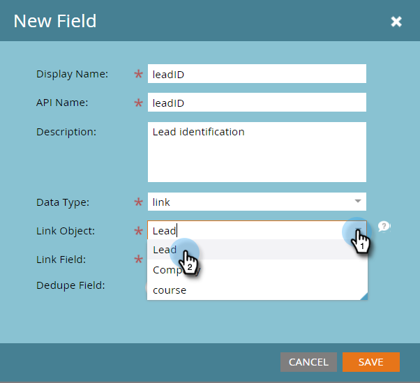
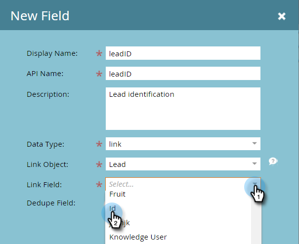
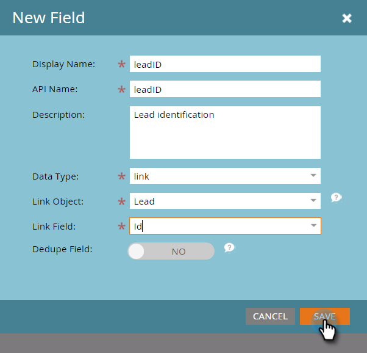

# Aggiungere campi collegamento oggetto personalizzato di Marketo {#add-marketo-custom-object-link-fields}

Quando si creano oggetti personalizzati, è necessario fornire campi di collegamento per collegare il record oggetto personalizzato al record padre corretto.

* Per una struttura personalizzata uno-a-molti, utilizza il campo collegamento nell’oggetto personalizzato per connetterlo a una persona o a un’azienda.
* Per una struttura molti-a-molti, si utilizzano due campi di collegamento, connessi da un oggetto intermedio creato separatamente (che è anche un tipo di oggetto personalizzato). Un collegamento si connette a persone o società nel database e l&#39;altro all&#39;oggetto personalizzato. In questo caso, il campo del collegamento non si trova nell’oggetto personalizzato stesso.

>[!IMPORTANT]
>
>Marketo Engage supporta solo un singolo oggetto edge per ogni oggetto bridge nella relazione Many to Many (Da molti a molti). Nell’esempio fornito di seguito, ogni iscrizione può essere collegata solo a un singolo corso. Tuttavia, possono esserci molti oggetti ponte per ogni oggetto perimetrale, così come ci sono molte iscrizioni degli studenti a ogni corso (relazione molti-a-uno). Se i dati oggetto personalizzati sono strutturati in modo che esista più di un record oggetto di Edge per ciascun record oggetto di Bridge (uno-a-molti o molti-a-molti), è possibile creare più record oggetto di Bridge che fanno riferimento ciascuno a un singolo record oggetto di Edge per rappresentare tali dati in Marketo.

## Creare un campo collegamento per una struttura uno-a-molti {#create-a-link-field-for-a-one-to-many-structure}

Segui i passaggi seguenti per creare un campo di collegamento in un oggetto personalizzato per una struttura uno-a-molti.

1. Passa alla schermata **[!UICONTROL Admin]**.

   

1. Fai clic su **[!UICONTROL Marketo Custom Objects]**.

   

1. Selezionare l&#39;oggetto personalizzato nell&#39;elenco.

   

1. Nella scheda **[!UICONTROL Fields]**, fare clic su **[!UICONTROL New Field]**.

   

1. Assegna un nome al campo del collegamento e aggiungi un [!UICONTROL Description] facoltativo. Selezionare il tipo di dati [!UICONTROL Link].

   

   >[!CAUTION]
   >
   >Non è possibile tornare indietro e creare, modificare o eliminare un oggetto [!UICONTROL Link] o [!UICONTROL Dedupe Field] dopo l&#39;approvazione dell&#39;oggetto personalizzato.

1. Seleziona se [!UICONTROL Link Object] è per un [!UICONTROL lead] (persona) o un [!UICONTROL company].

   

   >[!NOTE]
   >
   >Se scegli [!UICONTROL lead], nell&#39;elenco verranno visualizzati l&#39;ID, l&#39;indirizzo e-mail ed eventuali campi personalizzati.
   >
   >Se scegli [!UICONTROL company], nell&#39;elenco verranno visualizzati l&#39;ID ed eventuali campi personalizzati.

1. Selezionare [!UICONTROL Link Field] a cui connettersi come elemento padre del nuovo campo.

   

   >[!NOTE]
   >
   >Solo i tipi di campo stringa sono supportati in [!UICONTROL Link Field].

1. Fai clic su **[!UICONTROL Save]**.

   

## Creare un campo di collegamento per una struttura Many-to-Many (Da molti-a-molti) {#create-a-link-field-for-a-many-to-many-structure}

Segui i passaggi seguenti per creare un campo di collegamento in un oggetto intermedio da utilizzare in una struttura molti-a-molti.

>[!PREREQUISITES]
>
>È necessario avere già creato l&#39;oggetto intermedio e tutti gli oggetti personalizzati a cui si desidera collegarlo.

1. Passa alla schermata **[!UICONTROL Admin]**.

   

1. Fai clic su **[!UICONTROL Marketo Custom Objects]**.

   

1. Seleziona l’oggetto intermedio a cui aggiungere il campo.

   

1. Nella scheda **[!UICONTROL Fields]**, fare clic su **[!UICONTROL New Field]**.

   

1. Crea due campi di collegamento, uno alla volta. Innanzitutto, assegna un nome al campo per i membri dell’elenco del database (ad esempio, leadID). Aggiungi un elemento [!UICONTROL Description] facoltativo. Selezionare [!UICONTROL link] [!UICONTROL Data Type].

   

   >[!CAUTION]
   >
   >Non è possibile tornare indietro e creare, modificare o eliminare un oggetto [!UICONTROL Link] o [!UICONTROL Dedupe Field] dopo l&#39;approvazione dell&#39;oggetto personalizzato.

1. Selezionare [!UICONTROL Link Object] dal database; in questo caso, [!UICONTROL Lead].

   

1. Selezionare [!UICONTROL Link Field] a cui connettersi, in questo caso [!UICONTROL Id].

   

   >[!NOTE]
   >
   >Solo i tipi di campo stringa sono supportati in [!UICONTROL Link Field].

1. Fai clic su **[!UICONTROL Save]**.

   

1. Ripeti questa procedura per il secondo collegamento all’oggetto personalizzato, in questo esempio, courseID. Il nome [!UICONTROL Link Object] sarà corso e [!UICONTROL Link Field] sarà courseID. Poiché hai già creato e approvato l’oggetto personalizzato del corso, queste selezioni sono disponibili nei menu a discesa.

   

1. Creare qualsiasi altro campo che si desidera utilizzare nell&#39;oggetto intermedio, ad esempio enrollmentID o livello.

## Utilizzo di oggetti personalizzati {#using-custom-objects}

Il passaggio successivo consiste nell’utilizzare questi oggetti personalizzati nei filtri delle campagne intelligenti. Con una relazione molti-a-molti, puoi selezionare più persone o aziende e più oggetti personalizzati. Nell’esempio seguente, verranno elencati tutti gli utenti del database che soddisfano questi criteri. Il campo Nome corso proviene dall&#39;oggetto personalizzato del corso e il livello di iscrizione proviene dall&#39;oggetto intermedio.

>[!MORELIKETHIS]
>
>* [Aggiungi campi oggetto personalizzati Marketo](/help/marketo/product-docs/administration/marketo-custom-objects/add-marketo-custom-object-fields.md)
>* [Modifica ed elimina un oggetto personalizzato di Marketo](/help/marketo/product-docs/administration/marketo-custom-objects/edit-and-delete-a-marketo-custom-object.md)
>* [Informazioni sugli oggetti personalizzati di Marketo](/help/marketo/product-docs/administration/marketo-custom-objects/understanding-marketo-custom-objects.md)
>* [Modifica ed elimina campi oggetto personalizzati di Marketo](/help/marketo/product-docs/administration/marketo-custom-objects/edit-and-delete-marketo-custom-object-fields.md)
