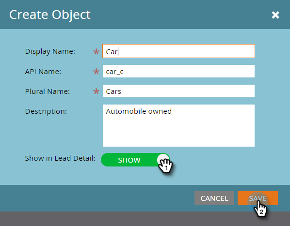
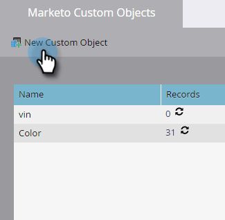

# Creare oggetti personalizzati di Marketo {#create-marketo-custom-objects}

Utilizza oggetti personalizzati in Marketo per tenere traccia delle metriche specifiche della tua azienda. Può trattarsi di qualsiasi cosa, dalle automobili ai corsi, qualsiasi cosa si desideri modellare in Marketo per eseguire le campagne.

>[!NOTE]
>
>È possibile impostare gli oggetti personalizzati in modo che funzionino su base uno-a-molti o molti-a-molti. L&#39;oggetto iniziale viene creato nello stesso modo, ma i passaggi sono diversi quando si inizia ad aggiungere campi all&#39;oggetto. Per ulteriori informazioni, vedere [Informazioni sugli oggetti personalizzati di Marketo](/help/marketo/product-docs/administration/marketo-custom-objects/understanding-marketo-custom-objects.md).

>[!NOTE]
>
>Non è possibile creare, modificare o eliminare un campo collegamento o deduplicazione dopo l&#39;approvazione dell&#39;oggetto personalizzato.

## Creare un oggetto personalizzato per una struttura uno-a-molti {#create-a-custom-object-for-a-one-to-many-structure}

Questo esempio mostra un oggetto personalizzato Car, da utilizzare in una struttura uno-a-molti. In seguito, creerai un oggetto personalizzato del corso e un oggetto intermedio da utilizzare in una struttura molti-a-molti.

1. Passa alla schermata **[!UICONTROL Admin]**.

   

1. Fai clic su **[!UICONTROL Marketo Custom Objects]**.

   

1. Fai clic su **[!UICONTROL New Custom Object]**.

   

   >[!NOTE]
   >
   >Nella scheda [!UICONTROL Marketo Custom Objects] vengono visualizzati tutti gli oggetti personalizzati a destra e i dettagli di quelli approvati, incluso il numero di record e campi al momento dell&#39;aggiornamento più recente.

1. Immetti [!UICONTROL Display Name]. [!UICONTROL API Name] e [!UICONTROL Plural Name] vengono compilati automaticamente. Immettere un [!UICONTROL Description] (facoltativo).

   

   >[!NOTE]
   >
   >È possibile modificare questi campi durante la creazione, ma dopo il salvataggio è possibile modificare solo il campo [!UICONTROL Plural Name] e il cursore **[!UICONTROL Show in Lead Detail]**.

1. Richiamare il cursore **[!UICONTROL Show in Lead Detail]** per visualizzare **[!UICONTROL Show]** se si desidera visualizzare i dati oggetto personalizzati nella pagina Database. Fai clic su **[!UICONTROL Save]**.

   

1. Nelle informazioni personalizzate sugli oggetti viene visualizzato il contenuto immesso. Si noti che è in uno stato **[!UICONTROL Draft]**.

   

   Il passaggio successivo consiste nell&#39;aggiungere campi a [compilare l&#39;oggetto personalizzato](/help/marketo/product-docs/administration/marketo-custom-objects/add-marketo-custom-object-fields.md).

   >[!NOTE]
   >
   >Puoi popolare gli oggetti personalizzati di Marketo solo tramite un&#39;importazione elenco o l&#39;[API](https://experienceleague.adobe.com/it/docs/marketo-developer/marketo/rest/rest-api).

## Creare un oggetto personalizzato per una struttura Many-to-Many (Da molti-a-molti) {#create-a-custom-object-for-a-many-to-many-structure}

Questo esempio mostra un oggetto personalizzato del corso, che verrà utilizzato per creare una relazione molti-a-molti tra persone o aziende e corsi. Al termine dell&#39;operazione, verrà creato un oggetto intermediario per collegarlo alle persone o alle società del database.

>[!NOTE]
>
>Per una relazione molti-a-molti, non è necessario creare un collegamento nell’oggetto personalizzato. Al contrario, aggiungerai due collegamenti all’oggetto intermedio (vedi sotto).

1. Passa alla schermata **[!UICONTROL Admin]**.

   

1. Fai clic su **[!UICONTROL Marketo Custom Objects]**.

   

1. Fai clic su **[!UICONTROL New Custom Object]**.

   

1. Immetti [!UICONTROL Display Name]. [!UICONTROL API Name] e [!UICONTROL Plural Name] vengono compilati automaticamente. Immettere un [!UICONTROL Description] (facoltativo).

   

   >[!NOTE]
   >
   >È possibile modificare questi campi durante la creazione, ma dopo il salvataggio è possibile modificare solo il campo [!UICONTROL Plural Name] e il cursore **[!UICONTROL Show in Lead Detail]**.

1. Richiamare il cursore **[!UICONTROL Show in Lead Detail]** per visualizzare **[!UICONTROL Show]** se si desidera visualizzare i dati oggetto personalizzati nella pagina Database. Fai clic su **[!UICONTROL Save]**.

   

1. Nelle informazioni personalizzate sugli oggetti viene visualizzato il contenuto immesso. Si noti che è in uno stato **[!UICONTROL Draft]**.

   

   >[!NOTE]
   >
   >Puoi popolare gli oggetti personalizzati di Marketo solo tramite un&#39;importazione elenco o l&#39;[API](https://experienceleague.adobe.com/it/docs/marketo-developer/marketo/rest/rest-api).

Il passaggio successivo consiste nel creare l&#39;oggetto intermedio (vedi sotto). Prima di ciò, devi creare un campo a cui collegarti.

## Creare un oggetto intermedio {#create-an-intermediary-object}

Utilizzare un oggetto intermediario per connettere un oggetto personalizzato a utenti o società. In questo esempio, viene utilizzato per collegare i corsi nell’oggetto personalizzato del corso a persone o aziende nel database.

>[!NOTE]
>
>Non è necessario creare un oggetto intermedio per una struttura oggetto personalizzata uno-a-molti.

1. Passa alla schermata **[!UICONTROL Admin]**.

   

1. Fai clic su **[!UICONTROL Marketo Custom Objects]**.

   

1. Fai clic su **[!UICONTROL New Custom Object]**.

   

1. Immetti [!UICONTROL Display Name]. [!UICONTROL API Name] e [!UICONTROL Plural Name] vengono compilati automaticamente. Immettere un [!UICONTROL Description] (facoltativo).

   

   >[!NOTE]
   >
   >È possibile modificare questi campi durante la creazione, ma dopo il salvataggio è possibile modificare solo il campo [!UICONTROL Plural Name] e il cursore [!UICONTROL Show in Lead Detail].

1. Richiamare il cursore **[!UICONTROL Show in Lead Detail]** per visualizzare **[!UICONTROL Show]** se si desidera visualizzare i dati oggetto personalizzati nella pagina Database. Fai clic su **[!UICONTROL Save]**.

   

1. Nelle informazioni personalizzate sugli oggetti viene visualizzato il contenuto immesso. Si noti che è in uno stato **[!UICONTROL Draft]**.

   Il passaggio successivo consiste nell&#39;aggiungere [campi collegamento](/help/marketo/product-docs/administration/marketo-custom-objects/add-marketo-custom-object-link-fields.md) per collegare l&#39;oggetto intermedio a una persona o a un&#39;azienda e a un oggetto personalizzato.

>[!MORELIKETHIS]
>
>* [Aggiungi campi oggetto personalizzati Marketo](/help/marketo/product-docs/administration/marketo-custom-objects/add-marketo-custom-object-fields.md)
>* [Aggiungi campi collegamento oggetto personalizzato Marketo](/help/marketo/product-docs/administration/marketo-custom-objects/add-marketo-custom-object-link-fields.md)
>* [Informazioni sugli oggetti personalizzati di Marketo](/help/marketo/product-docs/administration/marketo-custom-objects/understanding-marketo-custom-objects.md)
