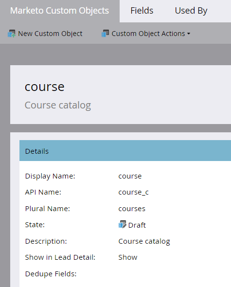

# Creare oggetti personalizzati di Marketo {#create-marketo-custom-objects}

Utilizza oggetti personalizzati in Marketo per tenere traccia delle metriche specifiche della tua azienda. Può trattarsi di qualsiasi cosa, dalle automobili ai corsi, qualsiasi cosa si desideri modellare in Marketo per eseguire le campagne.

>[!NOTE]
>
>È possibile impostare gli oggetti personalizzati in modo che funzionino su base uno-a-molti o molti-a-molti. L&#39;oggetto iniziale viene creato nello stesso modo, ma i passaggi sono diversi quando si inizia ad aggiungere campi all&#39;oggetto. Consulta  [Informazioni sugli oggetti personalizzati di Marketo](/help/marketo/product-docs/administration/marketo-custom-objects/understanding-marketo-custom-objects.md) per ulteriori informazioni.

>[!NOTE]
>
>Non è possibile creare, modificare o eliminare un campo collegamento o deduplicazione dopo l&#39;approvazione dell&#39;oggetto personalizzato.

## Creare un oggetto personalizzato per una struttura uno-a-molti {#create-a-custom-object-for-a-one-to-many-structure}

Questo esempio mostra un oggetto personalizzato Car, da utilizzare in una struttura uno-a-molti. In seguito, creerai un oggetto personalizzato del corso e un oggetto intermedio da utilizzare in una struttura molti-a-molti.

1. Vai a **[!UICONTROL Amministratore]** area.

   

1. Clic **[!UICONTROL Oggetti personalizzati Marketo]**.

   

1. Clic **[!UICONTROL Nuovo oggetto personalizzato]**.

   

   >[!NOTE]
   >
   >Il [!UICONTROL Oggetti personalizzati Marketo] Nella scheda vengono visualizzati tutti gli oggetti personalizzati a destra e i dettagli di tutti gli oggetti approvati, incluso il numero di record e campi al momento dell’aggiornamento più recente.

1. Immetti un [!UICONTROL Nome visualizzato]. Il [!UICONTROL Nome API] e [!UICONTROL Nome plurale] compila automaticamente. Immetti un [!UICONTROL Descrizione] (facoltativo).

   

   >[!NOTE]
   >
   >È possibile modificare questi campi durante la creazione, ma dopo averli salvati, è possibile modificare solo [!UICONTROL Nome plurale] e **[!UICONTROL Mostra in dettagli lead]** cursore.

1. Tirare la **[!UICONTROL Mostra in dettagli lead]** cursore sopra per visualizzare **[!UICONTROL Spettacolo]** se si desidera visualizzare i dati oggetto personalizzati nella pagina Database. Clic **[!UICONTROL Salva]**.

   

1. Nelle informazioni personalizzate sugli oggetti viene visualizzato il contenuto immesso. Lo stato è Bozza.

   

   Il passaggio successivo consiste nell’aggiungere campi a [creare l&#39;oggetto personalizzato](/help/marketo/product-docs/administration/marketo-custom-objects/add-marketo-custom-object-fields.md).

   >[!NOTE]
   >
   >È possibile popolare gli oggetti personalizzati di Marketo solo tramite un&#39;importazione elenco o [API](https://developers.marketo.com/documentation/rest/).

## Creare un oggetto personalizzato per una struttura Many-to-Many (Da molti-a-molti) {#create-a-custom-object-for-a-many-to-many-structure}

Questo esempio mostra un oggetto personalizzato del corso, che verrà utilizzato per creare una relazione molti-a-molti tra persone/aziende e corsi. Al termine dell&#39;operazione, verrà creato un oggetto intermediario per collegarlo alle persone o alle società del database.

>[!NOTE]
>
>Per una relazione molti-a-molti, non è necessario creare un collegamento nell&#39;oggetto personalizzato. Al contrario, aggiungerai due collegamenti all’oggetto intermedio (vedi sotto).

1. Vai a **[!UICONTROL Amministratore]** area.

   

1. Clic **[!UICONTROL Oggetti personalizzati Marketo]**.

   

1. Clic **[!UICONTROL Nuovo oggetto personalizzato]**.

   

1. Immetti un [!UICONTROL Nome visualizzato]. Il [!UICONTROL Nome API] e [!UICONTROL Nome plurale] compila automaticamente. Immetti un [!UICONTROL Descrizione] (facoltativo).

   

   >[!NOTE]
   >
   >È possibile modificare questi campi durante la creazione, ma dopo averli salvati, è possibile modificare solo [!UICONTROL Nome plurale] e **[!UICONTROL Mostra in dettagli lead]** cursore.

1. Tirare la **[!UICONTROL Mostra in dettagli lead]** cursore sopra per visualizzare **[!UICONTROL Spettacolo]** se si desidera visualizzare i dati oggetto personalizzati nella pagina Database. Clic **[!UICONTROL Salva]**.

   

1. Nelle informazioni personalizzate sugli oggetti viene visualizzato il contenuto immesso. Lo stato è Bozza.

   

   >[!NOTE]
   >
   >È possibile popolare gli oggetti personalizzati di Marketo solo tramite un&#39;importazione elenco o [API](https://developers.marketo.com/documentation/rest/).

Il passaggio successivo è la creazione dell’oggetto intermedio (vedi di seguito). Ma prima di questo, devi creare un campo a cui collegarti.

## Creare un oggetto intermedio {#create-an-intermediary-object}

Utilizzare un oggetto intermediario per connettere un oggetto personalizzato a utenti o società. In questo esempio, viene utilizzato per collegare i corsi nell’oggetto personalizzato del corso a persone o aziende nel database.

>[!NOTE]
>
>Non è necessario creare un oggetto intermedio per una struttura oggetto personalizzata uno-a-molti.

1. Vai a **[!UICONTROL Amministratore]** area.

   

1. Clic **[!UICONTROL Oggetti personalizzati Marketo]**.

   

1. Clic **[!UICONTROL Nuovo oggetto personalizzato]**.

   

1. Immetti un [!UICONTROL Nome visualizzato]. Il [!UICONTROL Nome API] e [!UICONTROL Nome plurale] compila automaticamente. Immetti un [!UICONTROL Descrizione] (facoltativo).

   

   >[!NOTE]
   >
   >È possibile modificare questi campi durante la creazione, ma dopo averli salvati, è possibile modificare solo [!UICONTROL Nome plurale] e [!UICONTROL Mostra in dettagli lead] cursore.

1. Tirare la **[!UICONTROL Mostra in dettagli lead]** cursore sopra per visualizzare **Spettacolo** se si desidera visualizzare i dati oggetto personalizzati nella pagina Database. Clic **Salva**.

   

1. Nelle informazioni personalizzate sugli oggetti viene visualizzato il contenuto immesso. Lo stato è Bozza.

   Il passaggio successivo consiste nel [aggiungi campi collegamento](/help/marketo/product-docs/administration/marketo-custom-objects/add-marketo-custom-object-link-fields.md) per collegare l&#39;oggetto intermedio a una persona/azienda e a un oggetto personalizzato.

>[!MORELIKETHIS]
>
>* [Aggiungi campi oggetto personalizzati Marketo](/help/marketo/product-docs/administration/marketo-custom-objects/add-marketo-custom-object-fields.md)
>* [Aggiungi campi collegamento oggetto personalizzato Marketo](/help/marketo/product-docs/administration/marketo-custom-objects/add-marketo-custom-object-link-fields.md)
>* [Informazioni sugli oggetti personalizzati di Marketo](/help/marketo/product-docs/administration/marketo-custom-objects/understanding-marketo-custom-objects.md)

