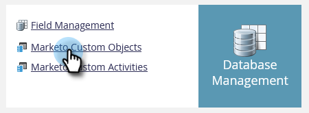

# Esportare metadati degli oggetti personalizzati {#custom-object-metadata-export}

Se si utilizza l&#39;API SOAP o l&#39;API [!DNL Munchkin], è possibile esportare lo schema metadati di oggetti personalizzati. Segui i passaggi seguenti.

>[!AVAILABILITY]
>
>Non tutti gli utenti di Marketo Engage hanno acquistato questa funzionalità. Per informazioni, contatta il team dell’account di Adobe (il tuo Account Manager).

1. Passa alla schermata **[!UICONTROL Admin]**.

   

1. Fai clic su **[!UICONTROL Marketo Custom Objects]**.

   

1. Selezionare l&#39;oggetto personalizzato Marketo da esportare.

   

1. Fai clic sul menu a discesa **[!UICONTROL Custom Object Actions]** e seleziona **[!UICONTROL Export Object]**.

   

>[!NOTE]
>
>L&#39;oggetto personalizzato deve trovarsi nello stato Approvato per essere esportato.

Ora disponi di un foglio di calcolo con lo schema dell’oggetto personalizzato, suddiviso in tre schede.

