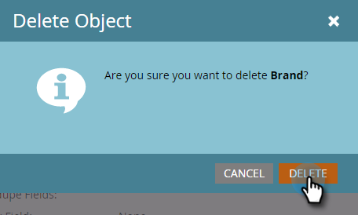
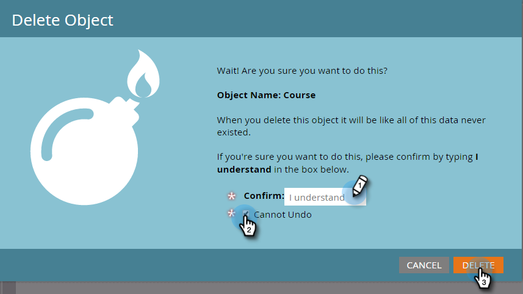

# Modificare ed eliminare un oggetto personalizzato di Marketo {#edit-and-delete-a-marketo-custom-object}

>[!NOTE]
>
>Non è possibile creare, modificare o eliminare un campo collegamento o deduplicazione dopo l&#39;approvazione dell&#39;oggetto personalizzato.

## Modificare un oggetto personalizzato {#edit-a-custom-object}

Utilizzare il menu Azioni oggetto personalizzato per modificare o eliminare un oggetto personalizzato.

1. Passa alla schermata **[!UICONTROL Admin]**.

   

1. Fai clic su **[!UICONTROL Marketo Custom Objects]**.

   

1. Seleziona l’oggetto personalizzato da modificare a destra.

   

1. Fare clic sulla scheda **[!UICONTROL Custom Object Actions]** e quindi su **[!UICONTROL Edit Object]**.

   

1. Apporta le modifiche desiderate. Trascinare il dispositivo di scorrimento se si desidera visualizzare l&#39;oggetto nella pagina Dettagli lead. Fai clic su **[!UICONTROL Save]**.

   

1. Assicurarsi di approvare [l&#39;oggetto modificato](/help/marketo/product-docs/administration/marketo-custom-objects/approve-a-custom-object.md).

## Eliminare un oggetto personalizzato {#delete-a-custom-object}

Eliminare un oggetto personalizzato è facile, ma è necessario prestare attenzione. Gli oggetti personalizzati possono essere connessi ad altri oggetti o a elenchi avanzati. Marketo ti avvisa quindi prima di fare clic su **[!UICONTROL Delete]**.

>[!CAUTION]
>
>Non è possibile ripristinare un oggetto personalizzato dopo averlo eliminato.

1. Passa alla schermata **[!UICONTROL Admin]**.

   

1. Fai clic su **[!UICONTROL Marketo Custom Objects]**.

   

1. Selezionare l&#39;oggetto da eliminare.

   

1. Fare clic su **[!UICONTROL Custom Object Actions]** e selezionare **[!UICONTROL Delete Object]**.

   

   >[!TIP]
   >
   >È inoltre possibile fare clic con il pulsante destro del mouse sull&#39;oggetto e selezionare **[!UICONTROL Delete Object]**.

1. Se l&#39;oggetto personalizzato è in formato bozza, non ancora approvato, verrà visualizzato questo avviso. Se sei sicuro, fai clic su **[!UICONTROL Delete]**.

   

1. Se l’oggetto personalizzato è già approvato, il rischio di eliminarlo è maggiore. Quindi, riceverete questo severo avviso. Immettere **[!UICONTROL I understand]**, selezionare la casella di controllo **[!UICONTROL Cannot Undo]** e fare clic su **[!UICONTROL Delete]**.

   

   >[!NOTE]
   >
   >Se l&#39;oggetto personalizzato è collegato a un oggetto intermedio, è necessario eliminare prima l&#39;oggetto intermedio.

>[!MORELIKETHIS]
>
>[Approva un oggetto personalizzato](/help/marketo/product-docs/administration/marketo-custom-objects/approve-a-custom-object.md)
