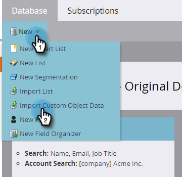

# Importare i dati dell’oggetto personalizzato {#import-custom-object-data}

Per importare dati oggetto personalizzati nel database, attenersi alla procedura descritta di seguito. Se si utilizzano oggetti personalizzati con società, vedere [Utilizzo di oggetti personalizzati con società](/help/marketo/product-docs/administration/marketo-custom-objects/understanding-marketo-custom-objects.md#using-custom-objects-with-companies) per ulteriori informazioni.

1. In Il mio Marketo, vai a **[!UICONTROL Database]**.

   

1. Fare clic su **[!UICONTROL New]** e selezionare **[!UICONTROL Import Custom Object Data]**.

   

1. Fare clic su **[!UICONTROL Browse]** per individuare il file di dati. Selezionare il formato del file (valori separati da virgola in questo esempio).

   

1. Seleziona [!UICONTROL custom object].

   

1. Selezionare [!UICONTROL Dedupe Mode] dal menu a discesa. Fai clic su **[!UICONTROL Next]**.

   

   >[!NOTE]
   >
   >Utilizzare uno o più campi di deduplicazione come identificatori univoci quando si creano o si aggiornano record oggetto personalizzati. In questo esempio viene utilizzato il campo Dedupe dell&#39;oggetto personalizzato **car** - vin (numero ID veicolo). Se si aggiornano solo record oggetto personalizzati, è possibile selezionare [!UICONTROL Marketo Guid] come [!UICONTROL Dedupe Mode].

1. Mappa ciascuna colonna su un campo Marketo, selezionandola dall’elenco a discesa.

   

   >[!NOTE]
   >
   >Assicurati che i valori nel file corrispondano al tipo di campo a cui stai corrispondendo (ad esempio, testo, numero intero, ecc.), altrimenti il file verrà rifiutato.

1. Fai clic su **[!UICONTROL Next]**.

   

1. Fai clic su **[!UICONTROL Import]**.

   

   >[!NOTE]
   >
   >Il limite di dimensione per gli oggetti personalizzati è di 100 MB.

   >[!TIP]
   >
   >Immetti il tuo indirizzo e-mail nel campo **[!UICONTROL Send Alert To]** e Marketo ti invierà un&#39;e-mail al termine dell&#39;importazione.

1. Nell’angolo in alto a destra dello schermo viene visualizzata una notifica mentre è in esecuzione l’importazione e al termine vengono visualizzati i risultati finali.

   

>[!MORELIKETHIS]
>
>[Informazioni sugli oggetti personalizzati di Marketo](/help/marketo/product-docs/administration/marketo-custom-objects/understanding-marketo-custom-objects.md)
