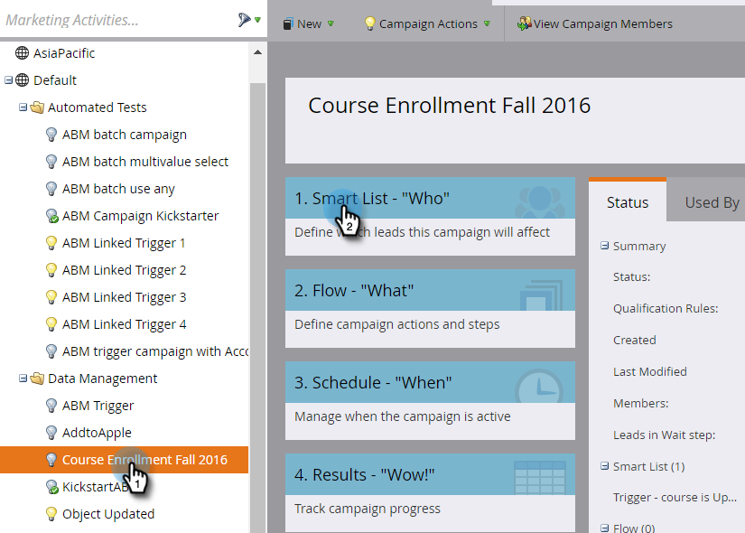
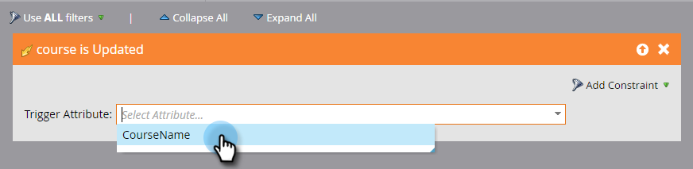

# Disattivare le modifiche all’oggetto personalizzato {#trigger-off-custom-object-changes}

>[!NOTE]
>
>Questa funzione è disponibile solo:
>
>* Da utilizzare solo con oggetti personalizzati di Marketo, non con oggetti personalizzati sincronizzati tramite l&#39;integrazione nativa di [!DNL Salesforce] o [!DNL Microsoft Dynamics]
>
>* Come attivatore, non come filtro
>
>Contattare il [Supporto Marketo](https://nation.marketo.com/t5/support/ct-p/Support) per attivare i trigger di modifica oggetti personalizzati.

Nell’elenco avanzato di una campagna avanzata, puoi attivare un’azione di flusso quando un oggetto personalizzato viene aggiunto a una persona o a un’azienda. Puoi anche creare un elenco avanzato che utilizza come attivatore una _modifica_ in un oggetto personalizzato. Ad esempio, utilizzalo per inviare un’e-mail quando il nome di un corso viene aggiornato.

>[!NOTE]
>
>Una voce del registro attività non viene creata quando viene modificato un record oggetto personalizzato.

1. In Marketo Engage, vai a **[!UICONTROL Marketing Activities]**.

   

1. Crea o apri una campagna avanzata esistente e seleziona l’elenco avanzato.

   

1. Cerca il trigger necessario e trascinalo sull’area di lavoro.

   

1. Seleziona [!UICONTROL trigger attribute].

   

1. È possibile impostare un vincolo.

   

1. La modifica viene salvata automaticamente.

   

   >[!NOTE]
   >
   >* [Creare un elenco avanzato](/help/marketo/product-docs/core-marketo-concepts/smart-lists-and-static-lists/creating-a-smart-list/create-a-smart-list.md)
   >* [Informazioni sugli oggetti personalizzati di Marketo](/help/marketo/product-docs/administration/marketo-custom-objects/understanding-marketo-custom-objects.md)
