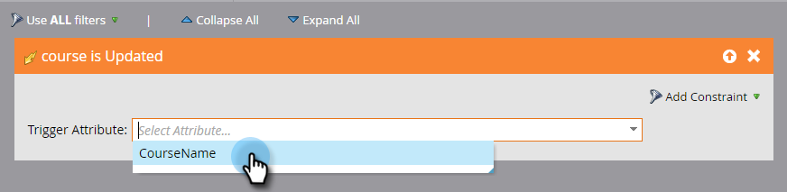

# Attiva modifiche a oggetti personalizzati {#trigger-off-custom-object-changes}

>[!NOTE]
>
>Questa funzione è disponibile solo:
>
>* Per i clienti dell&#39;infrastruttura Orion
>* Da utilizzare solo con oggetti personalizzati Marketo, non con oggetti personalizzati sincronizzati tramite l’integrazione nativa Salesforce o Microsoft Dynamics
>* Come attivatore, non come filtro
>
>Contattare [Supporto Marketo](https://nation.marketo.com/t5/Support/ct-p/Support) per abilitare i trigger di modifica oggetti personalizzati.

Nell’elenco smart di una campagna intelligente, puoi attivare un’azione di flusso quando un oggetto personalizzato viene aggiunto a una persona o a un’azienda. È inoltre possibile creare un elenco avanzato che utilizzi un *cambiare* in un oggetto personalizzato come attivatore. Ad esempio, utilizzalo per inviare un’e-mail quando il nome di un corso viene aggiornato.

>[!NOTE]
>
>Una voce del registro attività non viene creata quando viene modificato un record oggetto personalizzato.

1. In Marketo, vai a **Attività di marketing.**

   

1. Crea o apri una Smart Campaign esistente e seleziona l’Elenco avanzato.

   

1. Cerca il trigger desiderato e trascinalo sull’area di lavoro.

   

1. Seleziona l’attributo trigger.

   

1. Facoltativamente, impostare un vincolo.

   

1. Ed eccovi qui. La modifica viene salvata automaticamente.

   

   >[!NOTE]
   >
   >* [Creare un elenco avanzato](/help/marketo/product-docs/core-marketo-concepts/smart-lists-and-static-lists/creating-a-smart-list/create-a-smart-list.md)
   >* [Informazioni sugli oggetti personalizzati Marketo](/help/marketo/product-docs/administration/marketo-custom-objects/understanding-marketo-custom-objects.md)

