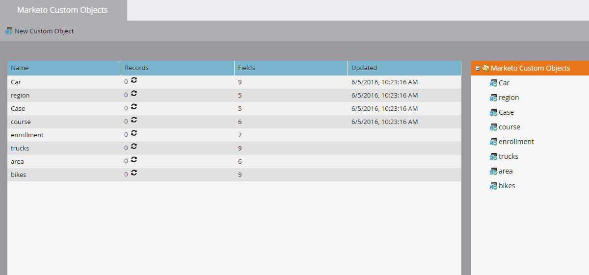

# Informazioni sugli oggetti personalizzati Marketo {#understanding-marketo-custom-objects}

Utilizza oggetti personalizzati per tenere traccia delle metriche specifiche della tua azienda.

>[!AVAILABILITY]
>
>Non tutti i clienti hanno acquistato questa funzionalità. Contatta il tuo rappresentante commerciale per i dettagli.

Utilizza oggetti personalizzati come filtri e attivatori nelle campagne avanzate. Ad esempio:

* **Filtro**: Invia e-mail solo ai proprietari di un marchio specifico di veicolo
* **Trigger**: Invia un messaggio e-mail quando un oggetto personalizzato viene aggiunto a una persona o a un&#39;azienda.

È possibile impostare oggetti personalizzati in una relazione uno-a-molti o molti-a-molti. Ad esempio:

* **Uno-a-molti**: Una persona possiede diverse auto
* **Many-to-Many (Da molti-a-molti)**: Più studenti iscritti a più corsi da un catalogo di corsi

Una struttura uno-a-molti utilizza un singolo campo di collegamento per collegare l’oggetto personalizzato a una persona o a un’azienda.

Gli oggetti personalizzati molti-a-molti utilizzano due campi di collegamento, parte di un oggetto intermedio. Un campo Collegamento è collegato alla persona o alla società e un altro è connesso all’oggetto personalizzato, ad esempio il catalogo del corso. Questo oggetto intermedio può contenere campi personalizzati aggiuntivi, ad esempio un livello del corso o una data di presenza, che definiscono ulteriormente la natura della connessione.

>[!TIP]
>
>Importa oggetti personalizzati utilizzando valori delimitati da virgole (CSV) all’interno dell’interfaccia utente per testare e convalidare un esempio di dati. Quindi, carica tutti i file con un’API.

>[!CAUTION]
>
>Non è possibile ripristinare gli oggetti personalizzati, quindi assicurati di non averne più bisogno prima di eliminarli.

## Accesso agli oggetti personalizzati Marketo {#accessing-marketo-custom-objects}

1. Per creare o modificare oggetti personalizzati Marketo, fare clic su **Amministratore** e poi **Oggetti personalizzati Marketo** link.

   

1. Nella visualizzazione Oggetti personalizzati di Marketo sono elencati tutti gli oggetti personalizzati sulla destra, ma solo quelli approvati nella griglia principale.

   

1. La griglia visualizza il nome dell’oggetto, il numero di record, il numero di campi e la data dell’aggiornamento più recente.

   >[!TIP]
   >
   >Marketo aggiorna automaticamente questi campi, ma puoi aggiornare la visualizzazione facendo clic sull&#39;icona nella colonna Record.

1. Fai clic sul nome dell’oggetto a destra per aprire la pagina dei dettagli.

   

## Visualizza oggetti personalizzati associati a una persona {#view-custom-objects-associated-to-a-person}

Dopo aver creato la struttura dell’oggetto personalizzato, quando si caricano i dati specifici dell’oggetto personalizzato, gli oggetti personalizzati vengono associati automaticamente alle persone presenti nel database utilizzando il campo di collegamento nell’oggetto personalizzato. È possibile visualizzare le informazioni dalla scheda Oggetti personalizzati nella pagina dei dettagli della persona.

1. Vai a **Database**.

   

1. Apri il database e fai clic su **Persone** scheda . Fare doppio clic sul record relativo a una persona associata a un oggetto personalizzato.

   

1. Nella pagina dei dettagli della persona, fai clic sul pulsante **Oggetti personalizzati** scheda . Seleziona l’oggetto dal menu a discesa.

   

1. Ora è possibile visualizzare un elenco di tutti gli oggetti personalizzati di quel tipo associati a tale persona.

   

## Utilizzo di oggetti personalizzati con le aziende {#using-custom-objects-with-companies}

Un oggetto personalizzato collegato all&#39;azienda funziona meglio se sincronizzi le aziende dal CRM o se crei società in modo esplicito utilizzando l&#39;API. Inoltre, ti consigliamo di utilizzare l&#39;ID società come campo di collegamento.

Se in Marketo sono presenti più persone che sono record nel CRM o solo nei record Marketo, un oggetto personalizzato collegato a un&#39;azienda non viene associato a più di un record singolo. Questo perché un&#39;azienda con più persone al suo interno è supportata solo quando le aziende sono sincronizzate dal CRM o se utilizzi un&#39;API per creare esplicitamente società.

Gli oggetti personalizzati possono essere collegati direttamente a un solo record. Ciò significa che, quando il tipo di oggetto personalizzato è collegato dal campo aziendale, è necessario assicurarsi che i record personali siano associati a una società utilizzando la conversione dei contatti nel CRM, oppure utilizzando il campo externalCompanyId, se gestisci le aziende utilizzando le API REST di Marketo. Per i record di persone che non sono collegati esplicitamente ai record aziendali, gli oggetti personalizzati collegati tramite società verranno collegati in modo casuale a un singolo record, anche se il valore del campo società viene condiviso tra più persone.

Vedi [Importa dati oggetto personalizzati](/help/marketo/product-docs/administration/marketo-custom-objects/import-custom-object-data.md) per ulteriori informazioni.

>[!MORELIKETHIS]
>
>* [Creare oggetti personalizzati Marketo](/help/marketo/product-docs/administration/marketo-custom-objects/create-marketo-custom-objects.md)
>* [Approvare un oggetto personalizzato](/help/marketo/product-docs/administration/marketo-custom-objects/approve-a-custom-object.md)
>* [Modificare ed eliminare un oggetto personalizzato Marketo](/help/marketo/product-docs/administration/marketo-custom-objects/edit-and-delete-a-marketo-custom-object.md)
>* [Aggiungi campi oggetto personalizzati Marketo](/help/marketo/product-docs/administration/marketo-custom-objects/add-marketo-custom-object-fields.md)
>* [Modificare ed eliminare i campi oggetto personalizzati Marketo](/help/marketo/product-docs/administration/marketo-custom-objects/edit-and-delete-marketo-custom-object-fields.md)
>* [Importa dati oggetto personalizzati](/help/marketo/product-docs/administration/marketo-custom-objects/import-custom-object-data.md)

